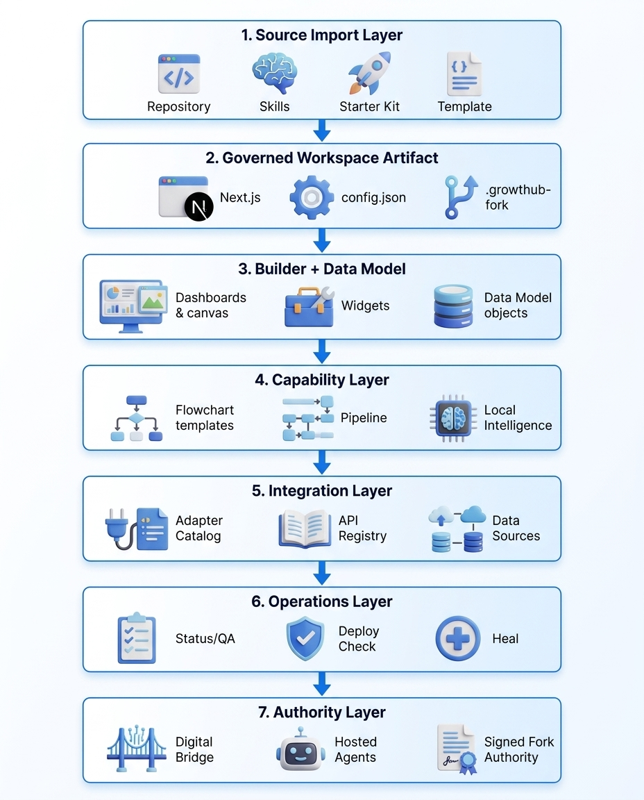

# Agent Workspace as Code (AWaC) — Growthub Local

**Growthub Local turns repos, skills, starters, kits, and templates into governed AI workspaces you can customize, operate with agents, deploy as apps, and keep current.**

**Agent Workspace as Code (AWaC)** means the workspace is the owned artifact: a forkable app, portable config, local builder, agent-readable contracts, lifecycle trace, and optional hosted authority only when the workspace needs it.


**Quick links:** [Start here](#start-here) · [Current reality](#current-shipped-reality) · [Architecture](#architecture) · [Install](#install) · [Docs](#docs)

---

## Start here: create a governed Workspace

Power-user one-liner:

```bash
npx -p @growthub/cli@latest growthub kit download growthub-custom-workspace-starter-v1 --out ./my-workspace --yes
cd my-workspace/apps/workspace
npm install
npm run dev
```

Or use the guided installer:

```bash
npm create @growthub/growthub-local@latest
```

Choose **Custom AI Governed Workspace**, then pick the fastest source:

1. [**Import a GitHub repo**](./docs/FIRST_RUN_PATHS.md#1-import-a-repo)
2. [**Import a skills.sh skill**](./docs/FIRST_RUN_PATHS.md#2-import-a-skill)
3. [**Start from the workspace starter**](./docs/FIRST_RUN_PATHS.md#3-start-from-a-workspace-starter)
4. [**Start from a workspace template**](./docs/FIRST_RUN_PATHS.md#4-browse-workspace-templates)

Agent commands:

```bash
npm create @growthub/growthub-local@latest
npm install -g @growthub/cli
growthub workspace status --json
```

**Reference contracts:** [Workspace Config Contract V1](./docs/WORKSPACE_CONFIG_CONTRACT_V1.md) · [Governed Workspace Topology V1](./docs/GOVERNED_WORKSPACE_TOPOLOGY_V1.md) · [Workspace Builder Runtime V1](./docs/WORKSPACE_BUILDER_RUNTIME_V1.md)
&nbsp;

---

## Architecture

AWaC in Growthub Local is the full governed workspace stack:



AWaC is the DevOps layer for AI workspaces. Instead of rebuilding agent setups by hand, Growthub Local makes the workspace itself portable, inspectable, repeatable, and safe to operate.

---

## Current shipped reality

Growthub Local's current line is one coherent AWaC surface, not separate release stories:

- **0.13.9** added Codex Sites as a governed workspace primitive: real site rows live in the Data Model, Builder renders them as Site items, and browser smoke tests prove the hosted URL without storing account-specific site data in source control.
- **0.14.0** added the governed creation cockpit: tested API Registry rows become profiled responses, optional helper-created resolvers, governed Data Sources, source-record refreshes, workflow persistence readiness, and Workspace Lens evidence.
- **0.14.1** adds the governed agent swarm cockpit: helper-created swarm workflow rows inherit the active execution target, open thread-bounded Background Tasks, run through `sandbox-run`, render truthful subagent telemetry, and map canvas node delta tags back to the owning sandbox record.
- **0.14.2** completes governed sandbox browser access: sandbox rows carry `browserAccess`, workflow and swarm nodes inherit it through the graph, local agents receive their native browser lanes, local processes receive the env contract, local intelligence executes browser tool intents through the local browser bridge, and serverless runs carry the same grant in the sandbox-run envelope.
- **0.14.4** adds Workspace CEO Primitive V1: `/ceo` becomes the helper-sidecar oversight cockpit, first-use setup proves a governed swarm loop once, History shows runtime outcomes, Agent Teams stores reusable blueprints, and linked teams open the real workflow canvas.
- **Growthub Browser agent protocol** packages the universal operating rule for agents: use the real in-app browser surface first, act through visible CUA when available, read back the DOM, and corroborate state through `/api/workspace`, source records, deployment status, or the configured store before claiming behavior.
- **Hosted authority is C-tier**: useful after local workspace value is proven, but not required for the core AWaC loop and not front-page operating authority.

This is the first-tier operating model for agents and humans: the browser is the no-code surface, helper proposals are reviewable, source records are evidence, workflows are governed rows, and Workspace Lens is the readiness surface.

Read the unified map: [Workspace New Reality Value Map V1](./docs/WORKSPACE_NEW_REALITY_VALUE_MAP_V1.md). CEO operating loop: [Workspace CEO Primitive V1](./docs/WORKSPACE_CEO_PRIMITIVE_V1.md). Browser execution details: [Governed Sandbox Browser Access V1](./docs/GOVERNED_SANDBOX_BROWSER_ACCESS_V1.md).

---

## Install

### Guided installer

```bash
npm create @growthub/growthub-local@latest
```

The guided installer is **workspace-first**:

1. without flags, it opens **Custom AI Governed Workspace** first
2. choose workspace starter, GitHub repo import, skills.sh import, workspace template, or the full discovery menu
3. use `--profile workspace` or `--profile self-improving` only when you want a direct non-interactive install lane

### Direct profile install

```bash
npm create @growthub/growthub-local@latest -- --profile workspace --out ./my-workspace
npm create @growthub/growthub-local@latest -- --profile self-improving --out ./my-workspace
```

Use profile selection to choose the governed workspace export path before deeper workflow and harness configuration.

### CLI-only install

```bash
npm install -g @growthub/cli
```

Growthub Local currently ships `@growthub/cli@0.14.8` and the guided installer `@growthub/create-growthub-local@0.14.8`, with the installer pin aligned to the CLI version. The `@growthub/api-contract` SDK is at `1.5.2`.

> Always read versions from `cli/package.json` / `packages/create-growthub-local/package.json` / `packages/api-contract/package.json` on your branch — see [docs/ARTIFACT_VERSIONS.md](./docs/ARTIFACT_VERSIONS.md).

---

## Features

<table>
  <tr>
    <td align="center"><strong>🧱 Workspace Builder</strong><br>No-code dashboard, tab, canvas, widget, template, import/export, and settings surface backed by validated config.</td>
    <td align="center"><strong>📊 Governed Data Model</strong><br>Business objects, rows, fields, relations, field settings, table helpers, and widget bindings live as first-class workspace state.</td>
    <td align="center"><strong>📥 Source Import</strong><br>GitHub repos, skills.sh skills, starters, and templates become governed workspaces through one lifecycle.</td>
  </tr>
  <tr>
    <td align="center"><strong>🔌 Integration Catalog</strong><br>Data-source and workspace-integration lanes cover analytics, commerce, ads, spreadsheets, project tools, docs, and CRM-style systems.</td>
    <td align="center"><strong>🧩 Resolver Layer</strong><br>Local resolver files, BYO credentials, API Registry rows, and Data Sources make live data governable.</td>
    <td align="center"><strong>🧪 Workspace Operations</strong><br><code>workspace status</code>, QA, deploy checks, upstream checks, surface detection, and browser proof are JSON-first.</td>
  </tr>
  <tr>
    <td align="center"><strong>🔁 Self-Healing Forks</strong><br>Fork registration, drift detection, dry-run heal plans, protected paths, background jobs, optional GitHub PR flow, and trace history.</td>
    <td align="center"><strong>🧰 Workspace Templates</strong><br>Template seeds ship governed config, SKILL.md, helpers, sub-skills, assumptions, examples, and output standards.</td>
    <td align="center"><strong>🤖 Agent Operations</strong><br>Local intelligence, helper proposals, workspace browser QA, source records, health checks, and governed traces.</td>
  </tr>
  <tr>
    <td align="center"><strong>⚙️ Workflows</strong><br>Saved workflow rows, draft/test/publish safety, execution payloads, artifacts, and structured results.</td>
    <td align="center"><strong>✨ Self-Improving Workspace</strong><br>Workspace improvement commands propose, list, and promote capabilities after runs so the workspace compounds over time.</td>
    <td align="center"><strong>🕹️ Browser Agent QA</strong><br>Visible CUA actions, DOM readback, and persistence corroboration make agents prove the same workspace humans see.</td>
  </tr>
  <tr>
    <td align="center"><strong>🚀 Deployable Workspace App</strong><br>Each workspace exports as a Next.js app with Vercel-ready project config, environment handoff, and deploy checks.</td>
    <td align="center"><strong>🧾 Policy + Trace</strong><br>Every governed fork carries identity, policy, session memory, self-eval records, trace events, and optional signed authority.</td>
    <td align="center"><strong>🤝 Human + Agent Co-Operability</strong><br>The builder, API, CLI, JSON outputs, skill manifests, and helper scripts expose the same workspace contracts.</td>
  </tr>
</table>

**AWaC benefits from Growthub Local**

| Without AWaC | With Growthub Local |
| --- | --- |
| Agent work starts from scattered repos, prompts, scripts, and one-off folders. | Every source becomes a governed Workspace with config, policy, trace, and lifecycle from the first run. |
| Useful repos and skills are hard to turn into repeatable production environments. | Repos, skills.sh skills, templates, and starters all enter the same governed workspace path. |
| Customization creates upgrade debt and makes upstream sync risky. | Forks are first-class and self-healing, with drift detection, previews, protected paths, and additive heals. |
| Data bindings can drift into fake, stale, or untested widget inputs. | API Registry and Data Source objects enforce test-before-bind data quality before widgets consume external data. |
| Secrets leak into config, browsers, local notes, or agent prompts. | Workspaces store `authRef` references only; provider secrets resolve server-side or through hosted authority. |
| Humans and agents operate through different paths, creating inconsistency. | The UI, PATCH API, CLI, resolvers, and JSON commands expose the same contracts to humans and agents. |
| Local experimentation is powerful but difficult to govern across a team. | Local control stays first while hosted authority can be added only when needed. |
| Workflows stay trapped in one machine or one prompt thread. | Workflows become reusable governed infrastructure objects that can be inspected, shared, evolved, and executed over time. |
| It is unclear what agents may safely automate. | Policies, confirmations, capability gates, and append-only trace make automation explicit and auditable. |
| Browser checks are treated as screenshots or manual QA afterthoughts. | The Growthub Browser protocol makes visible CUA actions, DOM readback, and persistence corroboration the agent QA loop. |
| Open-source freedom often means more maintenance burden and operational drift. | Growthub Local keeps open-source portability while adding self-healing lifecycle management and optional authority-backed trust. |

---

## Optional hosted authority

Hosted account authority is an optional C-tier extension. It is useful after a workspace has proven local value, but the core AWaC path does not depend on it.

Use hosted authority when you need account-backed integrations, higher-trust execution, or managed team workflows. Keep the front-line operating model local workspace first: Builder, Data Model, API Registry, helper proposals, workflows, source records, browser QA, and Workspace Lens.

---

## Docs

### Core workspace docs

- [**Quickstart — Governed Workspace**](./docs/QUICKSTART_WORKSPACE.md)
- [**Workspace New Reality Value Map V1**](./docs/WORKSPACE_NEW_REALITY_VALUE_MAP_V1.md)
- [**Workspace CEO Primitive V1**](./docs/WORKSPACE_CEO_PRIMITIVE_V1.md)
- [**Governed Agent Swarm Cockpit Value Map V1**](./docs/GOVERNED_AGENT_SWARM_COCKPIT_VALUE_MAP_V1.md)
- [**Governed Sandbox Browser Access V1**](./docs/GOVERNED_SANDBOX_BROWSER_ACCESS_V1.md)
- [**Agentic Workspace as Code Operating Framework**](./docs/AGENTIC_WORKSPACE_AS_CODE_OPERATING_FRAMEWORK.md)
- [**Governed Workspace Topology V1**](./docs/GOVERNED_WORKSPACE_TOPOLOGY_V1.md)
- [**Workspace Config Contract V1**](./docs/WORKSPACE_CONFIG_CONTRACT_V1.md)
- [**Workspace Helper V1**](./docs/WORKSPACE_HELPER_V1.md)

### Workspace Templates

Official workspace templates and shipped dashboard templates:

- [**Project Management Workspace Template**](./docs/PROJECT_MANAGEMENT_WORKSPACE_TEMPLATE.md) — official second workspace template for API-backed project task workflows, Nango-supported provider setup, sandbox workflow orchestration, and dashboard deltas
- [**Templates Index**](./docs/workspace-templates/README.md) — all five at a glance
- [Client Portal](./docs/workspace-templates/client-portal.md) — client status, documents, embedded portal area
- [Content Ops](./docs/workspace-templates/content-ops.md) — editorial pipeline and review snapshot
- [Reporting Dashboard](./docs/workspace-templates/reporting-dashboard.md) — KPIs, table, executive readout
- [Creative Review](./docs/workspace-templates/creative-review.md) — creative artifact embed and approval notes
- [Agency Delivery](./docs/workspace-templates/agency-delivery.md) — agency workstream, KPI, delivery notes

### More references

- [**Governed Workspace Primitives (user-facing)**](./cli/assets/worker-kits/growthub-custom-workspace-starter-v1/docs/governed-workspace-primitives.md) — how the six architectural primitives (SKILL.md, AGENTS.md pointer, session memory, self-evaluation, sub-skills, helpers) coordinate agents inside every exported workspace
- [**First-Run Paths**](./docs/FIRST_RUN_PATHS.md) — source choices for starting from a repo, skill, workspace starter, or workspace template

### Contributor references

- [Contributing](./CONTRIBUTING.md)
- [CLI README](./cli/README.md)

---

**One-line summary:** Growthub Local turns repos, skills, starters, and kits into governed workspaces you can customize, operate with agents, deploy, and keep current.
