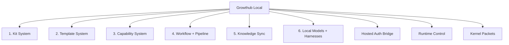

# Growthub Local


Growthub is an ecosystem for agents and humans where the CLI, machine bridge, profiles, artifacts, and integrations are first-class primitives.

The CLI is the local control plane, the hosted app is the identity and connection authority, and Worker Kits are the portable execution unit. That is the foundation of the API ecosystem and enterprise platform.

Growthub Local is a true agentic-first CLI ecosystem spawner designed for broad, production-grade use cases.


**Quick links:** [Ecosystem Map](#ecosystem-map) · [Quickstart](#quickstart) · [Feature Grid](#feature-grid) · [CLI Ecosystem Surfaces](#cli-ecosystem-surfaces) · [Docs](#docs)

## Why Growthub Local

| Ecosystem primitive | What it means |
| --- | --- |
| Local control plane | One CLI coordinates runtime, kits, templates, workflows, and harnesses. |
| Identity bridge | Hosted auth stays canonical while machine context stays local-first. |
| Portable execution | Worker Kits package complete runnable environments, not partial snippets. |

## Feature Grid

| Surface | Value |
| --- | --- |
| 🤖 Agent Harness | Paperclip Local App + Open Agents + Qwen Code in one flow |
| 🧰 Worker Kits | Portable, validated agent environments |
| 📚 Templates | Reusable creative and artifact primitives |
| 🔗 Workflows | Contracts, pipelines, orchestration |
| 🧠 Local Intelligence | Local model setup + chat flow |
| 🔐 Connect Growthub Account | Hosted identity + local machine bridge |
| ❓ Help CLI | Guided command navigation |

## Quickstart

```bash
# Guided installer
npm create growthub-local@latest

# Direct profile install
npm create growthub-local@latest -- --profile gtm
npm create growthub-local@latest -- --profile dx

# Custom Workspace Starter (scaffold + register as a fork in one shot)
npm create growthub-local@latest -- --profile workspace --out ./my-workspace

# CLI-only install
npm install -g @growthub/cli
```

Open discovery:

```bash
zsh /Users/antonio/growthub-local/scripts/demo-cli.sh cli discover
```

## Core Commands

```bash
# Main discovery
growthub
growthub discover

# Paperclip local app
growthub onboard
growthub run

# Open Agents harness
growthub open-agents
growthub open-agents config
growthub open-agents status
growthub open-agents prompt "your task"
growthub open-agents chat <session-id>

# Qwen harness
growthub qwen-code
growthub qwen-code health
growthub qwen-code prompt "your task"
growthub qwen-code session

# Kits, templates, workflows
growthub kit
growthub template
growthub workflow
growthub pipeline assemble

# Hosted auth bridge
growthub auth login
growthub auth whoami
growthub auth logout
```

## CLI Ecosystem Surfaces

The CLI is multiple product surfaces, not one.

<a id="ecosystem-map"></a>
### Ecosystem Map

<details>
<summary><strong>Open ecosystem chart</strong> — click section links to jump</summary>



**Surface index**

- [1) Kit System](#kit-system) — full environment provisioning and validation
- [2) Template System](#template-system) — reusable artifact library
- [3) Capability System](#capability-system) — contract discovery + machine-scoped resolution
- [4) Workflow + Pipeline System](#workflow--pipeline-system) — dynamic node orchestration graph layer
- [5) Knowledge Sync Surface](#knowledge-sync-surface) — two-way learning lane
- [6) Local Models + Harnesses](#local-models--harnesses) — local models + harness execution
- [Harness Authentication](#harness-authentication-native-cli) — native secure auth setup
- [Local Runtime Control](#local-runtime-control) — canonical local runtime commands
- [Docs](#docs) — contributor and architecture references

</details>

<a id="kit-system"></a>
<details>
<summary><strong>1) Kit System</strong> — full local app download and environment provisioning</summary>

- `growthub kit` interactive browser with type filtering
- `growthub kit download` complete worker environment download with fuzzy slug resolution
- `growthub kit families` taxonomy (`studio`, `workflow`, `operator`, `ops`)
- `growthub kit validate` schema and contract checks
- kit payload includes entrypoint, agent contract, templates, frozen assets, setup scripts, and env examples
- social media kits ship as `growthub-postiz-social-v1` (self-hosted Postiz) and `growthub-zernio-social-v1` (hosted Zernio REST API, 14 platforms)

</details>

<a id="template-system"></a>
<details>
<summary><strong>2) Template System</strong> — shared artifact library with structured filtering</summary>

- `growthub template` interactive picker
- artifact model supports ad-format and scene-module flows
- family/type/subtype-compatible filtering
- print/copy/fuzzy-resolve without coupling to kit installs

</details>

<a id="capability-system"></a>
<details>
<summary><strong>3) Capability System</strong> — CMS node discovery and machine-scoped resolution</summary>

- `growthub capability` interactive capability browser
- `growthub capability resolve` machine/user/org scoped execution visibility
- full contract introspection (inputs, outputs, execution strategy, binding requirements)

</details>

<a id="workflow--pipeline-system"></a>
<details>
<summary><strong>4) Workflow + Pipeline System</strong> — dynamic node orchestration graphs</summary>

- `growthub workflow` and saved workflow lifecycle actions
- `growthub pipeline assemble` dynamic hosted pipeline composition
- orchestration sits on full local runtime (server, db, ui, heartbeat, plugins, worktrees, observability)

</details>

<a id="knowledge-sync-surface"></a>
<details>
<summary><strong>5) Knowledge Sync Surface</strong> — compound learnings and knowledge evolution lane</summary>

- supports the two-way knowledge-sync direction for knowledge-engine
- designed as a first-class extension for building specialized intellegence layer for agents

</details>

<a id="local-models--harnesses"></a>
<details>
<summary><strong>6) Local Models + Harnesses</strong> — local custom models and external harness primitives</summary>

- local intelligence adapters for machine-local model flows
- harness-first integration for Open Agents and Qwen Code with native CLI auth/setup

</details>

## Harness Authentication (Native CLI)

### Open Agents

- Upstream: [vercel-labs/open-agents](https://github.com/vercel-labs/open-agents)
- Auth strategies in `Setup & Configure`:
  - `none`
  - `api-key`
  - `vercel-managed`
- API keys are saved in secure local harness storage.

### Qwen Code CLI

- Upstream: [QwenLM/qwen-code](https://github.com/QwenLM/qwen-code)
- `Configure` supports secure provider key setup/clear for:
  - `DASHSCOPE_API_KEY`
  - `OPENAI_API_KEY`
  - `ANTHROPIC_API_KEY`
  - `GOOGLE_API_KEY`
- Runtime uses both shell env + secure local harness keys.

## Local Runtime Control

From repo root:

```bash
scripts/runtime-control.sh up-main
scripts/runtime-control.sh up-branch <branch>
scripts/runtime-control.sh up-pr <pr-number>
scripts/runtime-control.sh status
scripts/runtime-control.sh stop
scripts/runtime-control.sh url
```

If the API is on `3101`:

```bash
GH_SERVER_PORT=3101 scripts/runtime-control.sh up-main
```

## Docs

- [Contributing](./CONTRIBUTING.md)
- [CLI Workflows Discovery V1](./docs/CLI_WORKFLOWS_DISCOVERY_V1.md)
- [Growthub Authentication Bridge](./docs/GROWTHUB_AUTH_BRIDGE.md)
- [Worker Kits Overview](./docs/WORKER_KITS.md)
- [Qwen Code CLI Integration](./docs/QWEN_CODE_CLI_INTEGRATION.md)
- [Local Native-Intelligence Architecture](./docs/NATIVE_INTELLIGENCE_LOCAL_ADAPTER_ARCHITECTURE.md)
- [Agent Harness Auth Primitive](./docs/AGENT_HARNESS_AUTH_PRIMITIVE.md)
- [Kernel Packet Registry](./docs/kernel-packets/README.md)
- [Custom Workspace Kernel Packet](./docs/kernel-packets/KERNEL_PACKET_CUSTOM_WORKSPACES.md)
- [Agent Harness Kernel Packet](./docs/kernel-packets/KERNEL_PACKET_AGENT_HARNESS.md)
- [Hosted SaaS Kit Kernel Packet](./docs/kernel-packets/KERNEL_PACKET_HOSTED_SAAS_KIT.md)
- [Fork Sync Agent Kernel Packet](./docs/kernel-packets/KERNEL_PACKET_FORK_SYNC_AGENT.md)

## Forking + Self-Healing Fork Sync Agent

Any bundled worker kit can be forked locally or via GitHub. The CLI ships a policy-driven, trace-backed, self-healing agent that keeps your fork in sync with upstream kit releases without ever overwriting your customisations.

Three storage surfaces, each self-contained:

- **In-fork state** at `<forkPath>/.growthub-fork/` — `fork.json`, `policy.json`, `trace.jsonl`, `jobs/`.  Canonical and portable.
- **CLI-owned kit-forks home** at `GROWTHUB_KIT_FORKS_HOME` (default `~/.growthub/kit-forks`) — `index.json`, `orphan-jobs/`.  Discovery pointers only.
- **CLI-owned GitHub home** at `GROWTHUB_GITHUB_HOME` (default `~/.growthub/github`) — `token.json` (chmod 600), `profile.json`.  Direct device-flow / PAT credentials only.


### Growthub integrations bridge

Users already authenticated into Growthub (via the gh-app) and with GitHub connected as a first-party integration there can use that connection through the CLI without re-authenticating:

```bash
growthub login                                # existing Growthub auth
growthub integrations status                  # list connected integrations (MCP/hosted bridge)
growthub integrations probe --provider github # test the resolver
```

The bridge is additive — direct CLI GitHub auth and the Growthub-hosted bridge are layered through a fixed-preference resolver (`direct → growthub-bridge`).  Bridge-minted credentials are never persisted to disk.

## Architecture Lanes

- **CLI/open-source lane:** discovery UX, command behavior, contributor docs
- **Maintainer/super-admin lane:** merge governance, release timing, npm publication
