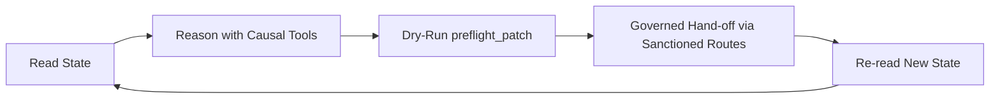

# Growthub Local — The Governed Workspace OS for Agent-Native Development

[](https://www.npmjs.com/package/@growthub/cli)
[](https://opensource.org/licenses/MIT)

> **A self-correcting, information-theoretic system that treats workspace data as a governed, low-entropy machine.**

**Quick links:** [Architecture thesis](#-the-architectural-thesis) · [Operational loop](#-the-operational-loop) · [Core features](#-core-features) · [Installation](#-installation) · [Quick start](#-quick-start) · [Documentation](#-documentation) · [Contributing](#-contributing)

Growthub Local is not a framework. It is not a platform. It is a **governed operating system for agent-native development**—a workspace where humans and AI agents collaborate through deterministic, auditable primitives.

---

## 📐 The Architectural Thesis

### Causal Derivation Intelligence (CDI)

Growthub Local applies **Information-Theoretic Transformation** to the workspace state:

> **Causation ITT** = A deterministic process that takes a high-entropy workspace state and transforms it into low-entropy, actionable guidance through pure, read-only derivation.

```
state → eligibility → guidance → action → evidence
```

This is the engine that powers every operation in the system.

### The Mathematical Foundation

A workspace with many objects, relationships, receipts, configs, sandboxes, traces, and potential inconsistencies is a **high-entropy state**. The causal derivation layer applies a deterministic compression function:

```
E(state) = Shannon entropy of workspace state
D(state) = Causal Derivation (compression function)
O(state) = D(state) (low-entropy output)

O(state) = compress(E(state)) where compress is deterministic and information-preserving
```

---

## 🔄 The Operational Loop

From `GOVERNED_MCP_CONSOLE_V1.md`, the system operates through an explicit, iterative agent loop:

### 1. READ

Agent reads the full current workspace state and provenance (all objects, relationships, receipts, traces).

### 2. REASON

Agent uses causal tools:

- `simulate_causal_impact` — Predict what dashboards, widgets, workflows, or downstream surfaces would be affected by a change
- `trace_lineage` + `find_downstream_dependencies` — Map actual dependency chains across the workspace graph

### 3. DRY-RUN

Agent uses `preflight_patch` to test the exact change against the **Law layer** without writing anything. The system checks if the change would violate any governance rules.

### 4. GOVERNED HAND-OFF

Agent emits only **sanctioned routes** (e.g., `PATCH /api/workspace`). The governance layer ensures the mutation stays inside the workspace boundary.

### 5. RE-READ

Agent re-reads the new state. Live rehydration happens on every call—no stale state, no assumptions.


```mermaid
graph LR
    A[Read State] --> B[Reason with Causal Tools]
    B --> C[Dry-Run preflight_patch]
    C --> D[Governed Hand-off via Sanctioned Routes]
    D --> E[Re-read New State]
    E --> A
```

---

## 🧩 The Workspace Topology — Algebraic Refinement

The system uses TypeScript's type system to enforce algebraic constraints on the derivation process. This is the governance shell that ensures all products conform to a governed shape.

### Hierarchy

```
MarketplaceProduct
  ├── SchedulerProduct (executionLane: 'serverless-scheduler')
  │     ├── QStashProduct (authRef: 'QSTASH')
  │     └── FutureSchedulerProduct
  ├── DataProduct (executionLane: 'workspace-data')
  │     ├── RedisProduct (authRef: 'UPSTASH_REDIS')
  │     └── NeonProduct
  └── RetrievalProduct (executionLane: 'workspace-retrieval')
        ├── SearchProduct
        └── VectorProduct
```

### Algebraic Constraints

The type system enforces that a product must:

1. Have the correct fields for its `executionLane`
2. Provide the required `envRef` for its `authRef`
3. Implement the readiness probe for its lane

### The Recursive Constraint

```
Type constraint → Product shape → Product verification → Type constraint
```

The type system constrains what products can exist, which enables the causal layer to reason about products, which produces evidence that can be used to refine the type system.

---

## 📈 The Scaling Phenomenon

### Entropy Reduction

Traditional agent systems scale complexity poorly:

| System Type | Complexity Scaling | Error Rate |
|-------------|--------------------|------------|
| Traditional agent systems | Grows linearly (or worse) with surface area | Compounds over time |
| Growthub's causal-driven system | Marginal cost decreases over time | Remains bounded by governance layer |

### The Recursive Flywheel

```
more evidence → better derivation → safer actions → more evidence → better derivation
```

This is the recursive scaling property. The more the system is used, the better it becomes at handling complexity.

### The Four Layers of Recursion

1. **The Derivation Loop:** state → eligibility → guidance → action → evidence → (new state) → re-derive
2. **The Flywheel:** more evidence → better derivation → safer actions → more evidence → better derivation
3. **The Algebraic Recursion:** Type constraint → Product shape → Product verification → Type constraint
4. **The Agent Loop:** Read → Reason → Dry-Run → Act → Re-read → (loop)

### The Tension That Makes It Work

Recursive inference vs. the Law:

```
if (state.patch.violatesLaw) return 403;
```

The system has recursive capabilities (infinite derivation loops, self-improving drivers) but is bounded by the "Law layer" that enforces governance. This prevents the recursion from becoming unbounded or unsafe.

---

## 🚀 Core Features

### Governed Marketplace Plugins V1

Official marketplace plugins are governed workspace capabilities installed into the existing Agent Workspace as Code universe. A plugin does not create a second runtime, database, workflow engine, or mutation lane. It registers governed rows, server-side env references, UI affordances, receipts, and provider-specific adapters that operate through the workspace's existing control plane.

**The rule:** Plugins extend the governed workspace universe; they do not bypass it.

```

---

## 🏗️ Technical Stack

| Layer | Technology |
|-------|------------|
| Runtime | Node.js (JavaScript/TypeScript) |
| Package Manager | npm |
| Type System | TypeScript with strict algebraic constraints |
| API Layer | Next.js App Router |
| Data Model | API Registry as source of truth |
| Event Sourcing | Receipt ledger (`workspace:agent-outcomes`) |
| Agent Protocol | MCP (Model Context Protocol) |
| External Providers | Upstash, Supabase, Stripe, Resend, Neon, Cloudflare R2 |

---

## 📦 Installation

### Guided installer

```bash
npm create @growthub/growthub-local@latest
```

Choose **Custom AI Governed Workspace**, then pick the fastest source:

1. [Import a GitHub repo](./docs/FIRST_RUN_PATHS.md#1-import-a-repo)
2. [Import a skills.sh skill](./docs/FIRST_RUN_PATHS.md#2-import-a-skill)
3. [Start from the workspace starter](./docs/FIRST_RUN_PATHS.md#3-start-from-a-workspace-starter)
4. [Start from a workspace template](./docs/FIRST_RUN_PATHS.md#4-browse-workspace-templates)

### Direct profile install

```bash
npm create @growthub/growthub-local@latest -- --profile workspace --out ./my-workspace
npm create @growthub/growthub-local@latest -- --profile self-improving --out ./my-workspace
```

### Power-user starter export

```bash
npx -p @growthub/cli@latest growthub kit download growthub-custom-workspace-starter-v1 --out ./my-workspace --yes
cd my-workspace/apps/workspace
npm install
npm run dev
```

### CLI-only install

```bash
npm install -g @growthub/cli@latest
growthub workspace status --json
```

For version grounding, read `cli/package.json`, `packages/create-growthub-local/package.json`, and `packages/api-contract/package.json` on the branch. See [Artifact Versions](./docs/ARTIFACT_VERSIONS.md).

---

## 🚀 Quick Start

### 1. Install a Provider

Open the Add-ons Marketplace in your workspace, select a provider (e.g., Upstash), and complete the setup flow. The provider row appears in the API Registry with `syncStatus: verified`.

### 2. Configure a Workflow

Open the Workflow Canvas, create a new workflow, and set the Input Node to Serverless Schedule with your desired cron expression.

### 3. Use `/schedule`

Open the Workspace Helper and type `/schedule`. The Schedule Cockpit opens, showing:

- Total workflows
- Scheduled workflows
- Ready workflows
- Blocked workflows
- Per-row readiness state
- Installed schedule ID
- Cron expression
- Region
- Last run status
- Governed actions (pause, resume, downgrade)

---

## 📚 Documentation

| Document | Description |
|----------|-------------|
| [Official Marketplace Plugins V1](./docs/OFFICIAL_MARKETPLACE_PLUGINS_V1.md) | The governed plugin model |
| [Serverless Scheduler Command Guide V1](./docs/SERVERLESS_SCHEDULER_COMMAND_GUIDE_V1.md) | The `/schedule` command lifecycle |
| [Causation ITT Eligibility Drivers](./docs/CAUSATION_ITT_ELIGIBILITY_DRIVERS.md) | The mathematical foundation of CDI |
| [Governed MCP Console V1](./docs/GOVERNED_MCP_CONSOLE_V1.md) | The agent operational loop |
| [First-Run Paths](./docs/FIRST_RUN_PATHS.md) | The canonical repo, skill, starter, and template entry paths |
| [Governed Workspace Topology V1](./docs/GOVERNED_WORKSPACE_TOPOLOGY_V1.md) | The official AWaC workspace topology |
| [Agent Dist Rebuild Guide](./docs/AGENT_DIST_REBUILD_GUIDE.md) | Source/dist lane rules and when version bumps are required |


---

## 🤝 Contributing

Growthub Local is built on the principle that plugins extend the governed workspace universe; they do not bypass it.

### The Invariant

```
The provider supplies power.
The workspace supplies authority.
The graph supplies causality.
The cockpit supplies operation.
The receipt supplies truth.
```

---

## 📄 License

MIT © Growthub AI

---

## 🙏 Acknowledgments

This system is built on the foundational insight that governance is not optional. The academic and production literature of 2026 converges on this truth:

> "Runtime governance is non-negotiable. Deterministic policy enforcement beneath the model layer prevents undesired actions before they reach the wire."

Growthub Local is the implementation of that insight.

---

**Growthub Local — The Governed Workspace OS for Agent-Native Development**

> "The provider supplies power. The workspace supplies authority. The graph supplies causality. The cockpit supplies operation. The receipt supplies truth."
