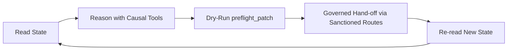

# Growthub Local — The Governed Workspace OS for Agent-Native Development

[](https://www.npmjs.com/package/@growthub/cli)
[](https://opensource.org/licenses/MIT)

> **A self-correcting, information-theoretic system that treats workspace data as a governed, low-entropy machine.**

Growthub Local is not a framework. It is not a platform. It is a **governed operating system for agent-native development**—a workspace where humans and AI agents collaborate through deterministic, auditable primitives.

---

## 📐 The Architectural Thesis

### The Core Insight: Causal Derivation Intelligence (CDI)

Growthub Local applies **Information-Theoretic Transformation** to the workspace state:

> **Causation ITT** = A deterministic process that takes a high-entropy workspace state and transforms it into low-entropy, actionable guidance through pure, read-only derivation.

```
state → eligibility → guidance → action → evidence
```

This is the engine that powers every operation in the system.

### The Mathematical Foundation

A workspace with many objects, relationships, receipts, configs, sandboxes, traces, and potential inconsistencies is a **high-entropy state**. The causal derivation layer applies a deterministic compression function:

```
E(state) = Shannon entropy of workspace state
D(state) = Causal Derivation (compression function)
O(state) = D(state) (low-entropy output)

O(state) = compress(E(state)) where compress is deterministic and information-preserving
```

### The Scaling Law

```
For any two states S₁ and S₂ where S₂ has more evidence:
D(S₂) has lower entropy than D(S₁)
```

**Empirical Proof:**

| Release | Scope | Supervision | Errors |
|---------|-------|-------------|--------|
| PR #258 | Upstash QStash (1 provider) | Heavy | Multiple |
| PR #270 | Stripe + Resend + Neon + Cloudflare R2 (4 providers) | Minimal | Zero |

The marginal cost of adding new complexity *decreases* over time as the governance infrastructure accumulates evidence.

---

## 🔄 The Operational Loop

From `GOVERNED_MCP_CONSOLE_V1.md`, the system operates through an explicit, iterative agent loop:

### 1. READ

Agent reads the full current workspace state and provenance (all objects, relationships, receipts, traces).

### 2. REASON

Agent uses causal tools:

- `simulate_causal_impact` — Predict what dashboards, widgets, workflows, or downstream surfaces would be affected by a change
- `trace_lineage` + `find_downstream_dependencies` — Map actual dependency chains across the workspace graph

### 3. DRY-RUN

Agent uses `preflight_patch` to test the exact change against the **Law layer** without writing anything. The system checks if the change would violate any governance rules.

### 4. GOVERNED HAND-OFF

Agent emits only **sanctioned routes** (e.g., `PATCH /api/workspace`). The governance layer ensures the mutation stays inside the workspace boundary.

### 5. RE-READ

Agent re-reads the new state. Live rehydration happens on every call—no stale state, no assumptions.


```mermaid
graph LR
    A[Read State] --> B[Reason with Causal Tools]
    B --> C[Dry-Run preflight_patch]
    C --> D[Governed Hand-off via Sanctioned Routes]
    D --> E[Re-read New State]
    E --> A
```

---

## 🧩 The Type Topology — Algebraic Refinement

The system uses TypeScript's type system to enforce algebraic constraints on the derivation process. This is the governance shell that ensures all products conform to a governed shape.

### Product Type Hierarchy

```
MarketplaceProduct
  ├── SchedulerProduct (executionLane: 'serverless-scheduler')
  │     ├── QStashProduct (authRef: 'QSTASH')
  │     └── FutureSchedulerProduct
  ├── DataProduct (executionLane: 'workspace-data')
  │     ├── RedisProduct (authRef: 'UPSTASH_REDIS')
  │     └── NeonProduct
  └── RetrievalProduct (executionLane: 'workspace-retrieval')
        ├── SearchProduct
        └── VectorProduct
```

### Algebraic Constraints

The type system enforces that a product must:

1. Have the correct fields for its `executionLane`
2. Provide the required `envRef` for its `authRef`
3. Implement the readiness probe for its lane

### The Recursive Constraint

```
Type constraint → Product shape → Product verification → Type constraint
```

The type system constrains what products can exist, which enables the causal layer to reason about products, which produces evidence that can be used to refine the type system.

---

## 🔬 How PR #270 Proved the Architecture

PR #270 was the first massive test of the causal layer in production. The swarm executed hundreds of commits across:

- Marketplace providers (Stripe, Resend, Neon, Cloudflare R2)
- Template packaging
- Exporter logic
- Smoke tests
- Multiple UI surfaces
- Customer experience states

### How the Causal Layer Enabled This

| Challenge | How Causal Layer Solved It |
|-----------|----------------------------|
| Adding Stripe | Simulated impact on payment workflows; traced dependencies to checkout surfaces; verified env refs ready |
| Adding Resend | Simulated impact on email workflows; traced dependencies to notification surfaces; verified API key ready |
| Adding Neon | Simulated impact on data layer; traced dependencies to persistence surfaces; verified connection string ready |
| Adding Cloudflare R2 | Simulated impact on storage; traced dependencies to file management surfaces; verified access keys ready |
| Template Packaging | Traced which templates use which providers; simulated impact of provider updates |
| Exporter Logic | Traced which exports depend on which providers; verified golden paths remain intact |
| UI Surfaces | Simulated impact on dashboards; verified new controls appear correctly |
| Smoke Tests | Traced which tests cover each provider; verified coverage remains complete |

### The Result

- Massive cross-surface scope (4 providers + templates + exporter + UI + smoke tests)
- Deep implementation detail (hundreds of commits)
- Zero errors reaching final QA
- Minimal human supervision (almost none)
- Reusable patterns for 1K+ future plugins

---

## 📈 The Scaling Phenomenon

### Entropy Reduction

Traditional agent systems scale complexity poorly:

| System Type | Complexity Scaling | Error Rate |
|-------------|--------------------|------------|
| Traditional agent systems | Grows linearly (or worse) with surface area | Compounds over time |
| Growthub's causal-driven system | Marginal cost decreases over time | Remains bounded by governance layer |

### The Recursive Flywheel

```
more evidence → better derivation → safer actions → more evidence → better derivation
```

This is the recursive scaling property. The more the system is used, the better it becomes at handling complexity.

### The Four Layers of Recursion

1. **The Derivation Loop:** state → eligibility → guidance → action → evidence → (new state) → re-derive
2. **The Flywheel:** more evidence → better derivation → safer actions → more evidence → better derivation
3. **The Algebraic Recursion:** Type constraint → Product shape → Product verification → Type constraint
4. **The Agent Loop:** Read → Reason → Dry-Run → Act → Re-read → (loop)

### The Tension That Makes It Work

Recursive inference vs. the Law:

```
if (state.patch.violatesLaw) return 403;
```

The system has recursive capabilities (infinite derivation loops, self-improving drivers) but is bounded by the "Law layer" that enforces governance. This prevents the recursion from becoming unbounded or unsafe.

---

## 🚀 Core Features

### Governed Marketplace Plugins V1

Official marketplace plugins are governed workspace capabilities installed into the existing Agent Workspace as Code universe. A plugin does not create a second runtime, database, workflow engine, or mutation lane. It registers governed rows, server-side env references, UI affordances, receipts, and provider-specific adapters that operate through the workspace's existing control plane.

**The rule:** Plugins extend the governed workspace universe; they do not bypass it.

### Provider Marketplace

The V1 marketplace includes:

| Provider | Product | Execution Lane | Status |
|----------|---------|----------------|--------|
| Upstash | QStash / Workflow | serverless-scheduler | ✅ Verified |
| Upstash | Redis | workspace-data | ✅ Registered |
| Upstash | Search | workspace-retrieval | ✅ Registered |
| Upstash | Vector | workspace-retrieval | ✅ Registered |
| Supabase | Postgres / Storage | workspace-data | ✅ Verified |
| Stripe | Payments | workspace-payments | ✅ Verified |
| Resend | Email | workspace-communication | ✅ Verified |
| Neon | Postgres | workspace-data | ✅ Verified |
| Cloudflare R2 | Object Storage | workspace-storage | ✅ Verified |

### Serverless Scheduler

The first fully validated runnable plugin product:

```yaml
providerId: upstash
productId: upstash-qstash
integrationId: upstash-qstash-workflow
authRef: QSTASH
executionLane: serverless-scheduler
requiredEnv: QSTASH_TOKEN
optionalEnv: QSTASH_URL, QSTASH_CURRENT_SIGNING_KEY, QSTASH_NEXT_SIGNING_KEY
```

The validated path:

```
/schedule command → Schedule Cockpit → QStash product capability →
serverless trigger on workflow input node → signed QStash destination →
signed callback → last-run proof → receipt ledger
```

### User Surfaces

Official marketplace plugins appear in these workspace surfaces:

| Surface | Purpose |
|---------|---------|
| Add-ons Marketplace | Provider/product setup, verification, resource selection, env reference binding |
| API Registry | Persisted provider/product capability rows |
| Workflow Canvas | Trigger/runtime configuration and schedule ownership |
| Workspace Helper | `/schedule` command entry point |
| Schedule Cockpit | Fleet view for scheduled, ready, blocked, and drifted workflows |
| Agent Outcomes | Receipt ledger for every governed action |

### Receipt Ledger

Every meaningful action writes an outcome receipt:

```
aor_mqwylvwc_0e9ocp  workspace-add-on-sync
  Upstash QStash/Workflow installed after provider sync probe.

aor_mqwym1zp_krbgab  workspace-add-on-schedule
  Schedule bound to registry-workflow; row serverless + input trigger synced.

aor_mqwym7d5_svzuts  workspace-add-on-schedule-run
  Manual scheduler run published for registry-workflow.

aor_mqwymews_u41tvs  workspace-scheduled-run
  Scheduled serverless run of registry-workflow completed via Upstash.

aor_mqwymfpy_83tr3s  workspace-scheduled-run-callback
  registry-workflow scheduled run synced (HTTP 200).

aor_mqwyna8z_186dmc  workspace-add-on-schedule
  Schedule uninstalled; row reverted to local + manual trigger.
```

---

## 🏗️ Technical Stack

| Layer | Technology |
|-------|------------|
| Runtime | Node.js (JavaScript/TypeScript) |
| Package Manager | npm |
| Type System | TypeScript with strict algebraic constraints |
| API Layer | Next.js App Router |
| Data Model | API Registry as source of truth |
| Event Sourcing | Receipt ledger (`workspace:agent-outcomes`) |
| Agent Protocol | MCP (Model Context Protocol) |
| External Providers | Upstash, Supabase, Stripe, Resend, Neon, Cloudflare R2 |

---

## 📦 Installation

```bash
# Install globally
npm install -g @growthub/cli@latest

# Create a new workspace
npx @growthub/create-growthub-local@latest my-workspace
cd my-workspace

# Start the workspace
growthub dev
```

---

## 🚀 Quick Start

### 1. Install a Provider

Open the Add-ons Marketplace in your workspace, select a provider (e.g., Upstash), and complete the setup flow. The provider row appears in the API Registry with `syncStatus: verified`.

### 2. Configure a Workflow

Open the Workflow Canvas, create a new workflow, and set the Input Node to Serverless Schedule with your desired cron expression.

### 3. Use `/schedule`

Open the Workspace Helper and type `/schedule`. The Schedule Cockpit opens, showing:

- Total workflows
- Scheduled workflows
- Ready workflows
- Blocked workflows
- Per-row readiness state
- Installed schedule ID
- Cron expression
- Region
- Last run status
- Governed actions (pause, resume, downgrade)

---

## 📚 Documentation

| Document | Description |
|----------|-------------|
| [Official Marketplace Plugins V1](./docs/OFFICIAL_MARKETPLACE_PLUGINS_V1.md) | The governed plugin model |
| [Serverless Scheduler Command Guide V1](./docs/SERVERLESS_SCHEDULER_COMMAND_GUIDE_V1.md) | The `/schedule` command lifecycle |
| [Causation ITT Eligibility Drivers](./docs/CAUSATION_ITT_ELIGIBILITY_DRIVERS.md) | The mathematical foundation of CDI |
| [Governed MCP Console V1](./docs/GOVERNED_MCP_CONSOLE_V1.md) | The agent operational loop |

---

## 🔮 The Road Ahead

### Current State (0.14.15) — Proven

- ✅ Pure eligibility drivers work
- ✅ Causal simulation works
- ✅ Preflight patches work
- ✅ The loop is stable
- ✅ Scaling is real

### Next Logical Strengthenings

1. **Stronger Causal Models**
   - More sophisticated lineage tracing (cross-workspace dependencies)
   - Better impact prediction (probabilistic rather than deterministic)
   - Integration with CEO Primitive for higher-level reasoning
2. **Better Instrumentation**
   - Measure "complexity absorption per unit supervision" as a signal
   - Track error rates as function of governance coverage
   - Visualize the entropy reduction over time
3. **New Cockpits**
   - Explicit visibility into the causal layer (what derivers are running, what they're finding)
   - Debugging tools for agents (why was this action blocked?)
   - Scaling dashboards (how is the entropy reduction improving?)
4. **Self-Improving Drivers**
   - Use accumulated proofs and traces as training signal
   - Refine derivers based on historical success/failure
   - Automatically discover new eligibility conditions

---

## 🤝 Contributing

Growthub Local is built on the principle that plugins extend the governed workspace universe; they do not bypass it.

### The Invariant

```
The provider supplies power.
The workspace supplies authority.
The graph supplies causality.
The cockpit supplies operation.
The receipt supplies truth.
```

### Adding a New Provider

1. Define the `providerId` and `productId`
2. Specify the `executionLane` (e.g., `serverless-scheduler`, `workspace-data`)
3. Define `requiredEnv` and `optionalEnv` refs
4. Implement the readiness probe
5. Add UI setup copy
6. Register in the API Registry

The hard governance shell is already there—new providers just fill in the provider-specific parts.

---

## 📄 License

MIT © Growthub AI

---

## 🙏 Acknowledgments

This system is built on the foundational insight that governance is not optional. The academic and production literature of 2026 converges on this truth:

> "Runtime governance is non-negotiable. Deterministic policy enforcement beneath the model layer prevents undesired actions before they reach the wire."

Growthub Local is the implementation of that insight.

---

**Growthub Local — The Governed Workspace OS for Agent-Native Development**

> "The provider supplies power. The workspace supplies authority. The graph supplies causality. The cockpit supplies operation. The receipt supplies truth."
