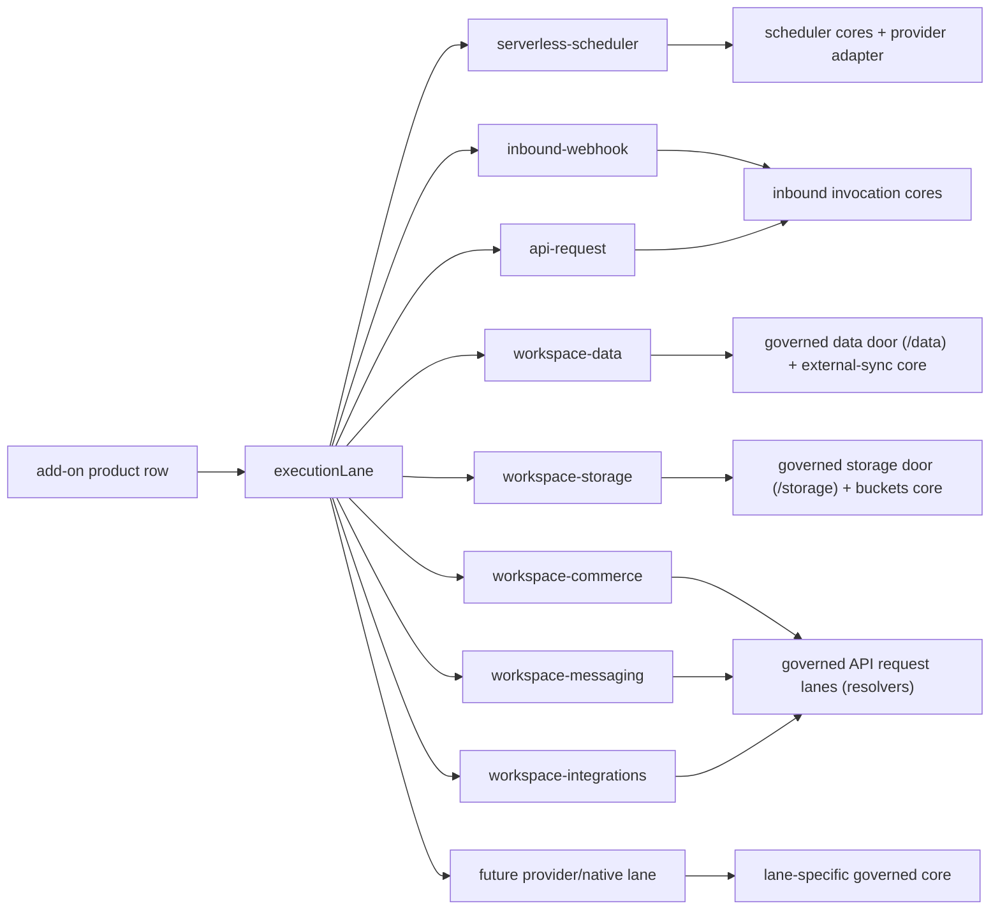

# Official Marketplace Plugins V1

Growthub Marketplace Plugins are governed workspace capabilities installed into
the existing Agent Workspace as Code universe. A plugin does not create a second
runtime, database, workflow engine, or mutation lane. It registers governed rows,
server-side env references, UI affordances, receipts, and provider-specific
adapters that operate through the workspace's existing control plane.

This is the official V1 plugin model for the custom workspace starter.

## Definition

An official marketplace plugin is a provider-backed capability bundle that can:

- register provider and product rows in the API Registry
- verify runtime readiness with server-side probes
- keep secrets in environment variables and persist only env references
- expose governed UI setup flows in the Add-ons Marketplace
- power workspace features through existing objects, routes, receipts, and
  helper surfaces
- record every install, run, callback, failure, and uninstall through
  `workspace:agent-outcomes`

Official plugins are workspace-native. They land as Data Model/API Registry
truth, not as opaque external app state.

## V1 Provider: Upstash

Upstash is the first official marketplace provider. The provider row represents
account/setup capability. Product rows represent runnable workspace
capabilities.

Provider:

- `providerId`: `upstash`
- provider account lane: Upstash Developer API
- setup fields: account email + management API key
- setup surface: Add-ons Marketplace / provider setup
- persisted truth: provider row and product rows in the API Registry
- secret rule: no API key, token, or signing key is persisted into config,
  receipts, browser payloads, or row output

## V1 Products

### Upstash QStash / Workflow

QStash is the first validated runnable plugin product.

It enables:

- serverless scheduled workflow runs
- deterministic per-workflow schedule ownership
- signed destination delivery
- signed callback/failure callback sync
- last-run proof written back to the owning workflow row
- `/schedule` cockpit visibility and controls
- receipt-backed audit for install, run, callback, and uninstall

Product identity:

- `productId`: `upstash-qstash`
- `integrationId`: `upstash-qstash-workflow`
- `authRef`: `QSTASH`
- execution lane: `serverless-scheduler`
- required env: `QSTASH_TOKEN`
- optional env: `QSTASH_URL`, `QSTASH_CURRENT_SIGNING_KEY`,
  `QSTASH_NEXT_SIGNING_KEY`

Validated V1 capability:

- QStash product sync verifies `/v2/schedules` over the live provider API.
- Serverless schedule install creates a real QStash schedule.
- QStash delivers to the workspace workflow destination.
- QStash callback returns success proof to the owning workflow row.
- Receipts record the full lifecycle.

### Upstash Redis

Redis is registered as a workspace data/cache capability.

It enables:

- Redis REST database registration
- governed env references for Redis URL/token
- readiness probing through `/ping`
- future cache, queue, rate-limit, and workspace data features

Product identity:

- `productId`: `upstash-redis`
- `integrationId`: `upstash-redis`
- `authRef`: `UPSTASH_REDIS`
- execution lane: `workspace-data`
- required env: `UPSTASH_REDIS_REST_URL`, `UPSTASH_REDIS_REST_TOKEN`

### Upstash Search

Search is registered as a retrieval/search capability.

It enables:

- search index registration
- governed env references for Search URL/token
- readiness probing through `/stats` and `/info`
- future workspace retrieval and document-search flows

Product identity:

- `productId`: `upstash-search`
- `integrationId`: `upstash-search`
- `authRef`: `UPSTASH_SEARCH`
- execution lane: `workspace-retrieval`
- required env: `UPSTASH_SEARCH_REST_URL`, `UPSTASH_SEARCH_REST_TOKEN`

### Upstash Vector

Vector is registered as a semantic retrieval capability.

It enables:

- vector index registration
- governed env references for Vector URL/token
- readiness probing through `/info`
- future semantic memory, retrieval, and embedding-backed workspace features

Product identity:

- `productId`: `upstash-vector`
- `integrationId`: `upstash-vector`
- `authRef`: `UPSTASH_VECTOR`
- execution lane: `workspace-retrieval`
- required env: `UPSTASH_VECTOR_REST_URL`, `UPSTASH_VECTOR_REST_TOKEN`

## V1 Provider: Vercel

Vercel is the second official marketplace provider and the first on the
bearer-token account lane. The provider row represents the account binding;
the product row represents the runnable one-click deployment capability.

Provider:

- `providerId`: `vercel`
- provider account lane: Vercel REST API (`Authorization: Bearer`)
- setup fields: access token + optional team ID (team-scoped tokens)
- setup surface: Add-ons Marketplace / provider setup
- account verification: live probe of `/v2/user` / `/v2/teams`
- persisted truth: provider row and product row in the API Registry
- secret rule: the token is stored only as the `VERCEL_TOKEN` env reference —
  never in config, receipts, browser payloads, or row output

### Vercel Deployments (One-Click Deploy)

Deployments is the validated runnable Vercel product.

It enables:

- server-side project discovery (`GET /v9/projects`; the browser never calls
  the Vercel API)
- linking each Vercel project as an atomic governed Data Model record in the
  `vercel-projects` custom object — zero schema/contract change
- one-click deploys through the governed deploy route
  (`POST /api/workspace/add-ons/vercel/deploy`): git-source lane for linked
  repos, redeploy lane for previously deployed projects
- deploy proof (deployment id, url, readyState) written back to the owning
  project record
- workflow linkage from the same record via the existing reference primitive
  (`linkedWorkflowRef` → sandbox-environment)
- receipt-backed audit for connect, link, and every deploy —
  `workspace-add-on-vercel-link` / `workspace-add-on-vercel-deploy`

Product identity:

- `productId`: `vercel-deployments`
- `integrationId`: `vercel-deployments`
- `authRef`: `VERCEL`
- execution lane: `workspace-deployments`
- required env: `VERCEL_TOKEN`
- optional env: `VERCEL_TEAM_ID`, `VERCEL_API_URL`

Validated V1 capability:

- Product sync verifies `/v9/projects` over the live provider API.
- Project link upserts governed `vercel-projects` records idempotently
  (operator extras and deploy proof are never clobbered by a re-link).
- One-click deploy auto-links the project first, so a deploy always lands as
  a governed Data Model record.
- Deploy surfaces: Add-ons Marketplace product cockpit and the project
  record's Data Model drawer (`Deploy to Vercel`).
- Receipts record the full lifecycle, including blocked outcomes with
  actionable next steps.

### Guided Create Production App (Vercel + GitHub)

Alongside "link existing", the Vercel provider page carries a guided creation
journey for new setups: private GitHub repo → starter seed → Vercel project
with the repo linked at creation (`POST /v11/projects` + `gitRepository`) →
initial deployment → governed record.

Journey contract:

- GitHub account lane: `GET/POST /api/workspace/add-ons/github/credentials`
  verifies a token against `GET /user` and persists only the `GITHUB_TOKEN`
  env reference (same pattern as the Vercel bearer lane)
- repo step: `POST …/vercel/create-app/github-repo` creates the PRIVATE repo
  (`/user/repos` or `/orgs/{org}/repos`) and seeds the starter page via the
  contents API — atomic step contract, real 2xx required
- project step: `POST …/vercel/create-app/project` creates the Vercel project
  with the repo linked at creation time (requires the Vercel GitHub App;
  failures map to specific guidance)
- validation gate: the creation steps write NOTHING to workspace config; the
  only persist in the chain is the existing governed deploy route, which runs
  after repo + project + deployment all return real successes and atomically
  writes the `vercel-projects` record with live proof
- success state: live production URL, repo link, deployment proof, and the
  governed Data Model record — every step's progress turns green only on a
  real server response (shared `deriveCreateAppChecklist` helper)
- receipts: `workspace-add-on-github-credentials` and
  `workspace-add-on-vercel-create-app` record published and blocked outcomes
  (token scope, name conflicts, GitHub App missing, deploy failures) with
  actionable next steps

## V1 Provider: Supabase

Supabase is the third official marketplace provider, the first on the
database-operations lane (`workspace-data`), and the first to ship **two
products on one account** (the Upstash multi-product pattern): Supabase
Postgres (PostgREST) on the `workspace-data` lane and Supabase Storage
(Global CDN) on the `workspace-storage` lane.

Provider:

- `providerId`: `supabase`
- provider account lane: Supabase Management API (Bearer personal access
  token), with a direct project-probe fallback (project URL + service key)
  when no management token is present
- setup fields: personal access token, or project URL + service role key
- setup surface: Add-ons Marketplace / provider setup
- persisted truth: provider row and product rows in the API Registry
- secret rule: identical to Upstash — no token or key is persisted into
  config, receipts, browser payloads, or row output; `.env.local` holds
  values, rows hold env-ref names only (including the `SUPABASE_API_KEY`
  alias write that lets the canonical `authRef` expansion resolve the key)

### Supabase Postgres (PostgREST)

Product identity:

- `productId`: `supabase-postgrest`
- `integrationId`: `supabase-postgrest`
- `authRef`: `SUPABASE`
- execution lane: `workspace-data`
- connector kind: `supabase-data`
- required env: `SUPABASE_URL`, `SUPABASE_SERVICE_ROLE_KEY`
- optional env: `SUPABASE_ANON_KEY`
- auth shape: key on the `apikey` header (gateway) plus `Authorization:
  Bearer` on the dedicated executors

Validated V1 capability:

- Resource discovery lists the account's projects over the Management API
  (`provider-bearer` mode) and binds the selected project's URL and keys to
  env refs (`urlTemplate` / `fromPath` mappings against
  `/v1/projects/{ref}/api-keys`).
- Product sync verifies the bound project with a read-only PostgREST probe.
- The `supabase-data` Workflow Canvas node executes governed database
  operations (select / insert / update / upsert / delete / rpc) through
  `POST /api/workspace/sandbox-run` with the same result envelope, node
  trace, and receipts as `api-registry-call`; filterless update/delete are
  refused before any request.
- External tables install as governed `data-source` Data Model objects, and
  the `/api/workspace/add-ons/[providerId]/data` route performs receipted
  pull / push (push verifies with a pull-merge round-trip) / bind / unbind —
  any governed object, the `workspace-app-registry` fleet table included,
  can bind to an external table.
- A tested `supabase-postgrest` row constructs a governed resolver through
  the Unified Resolver Registry (top-level PostgREST arrays profile clean),
  addressable at `/api/resolvers/supabase-postgrest`.
- `/settings/apps` derives a Supabase external link for the workspace app
  from the governed registry rows (same icon + popover + dedupe mechanism as
  the GitHub repository and Vercel deployment links), provider-agnostic over
  the `workspace-data` lane.
- Receipts (`workspace-add-on-data-sync` and the standard provider/product
  kinds) record the full lifecycle.
- **Live hydration (governed, power-when-present):** while a user views an
  externally-bound `data-source` object in the Data Model table, the
  `ExternalSyncHydrator` keeps it fresh. When the product declares a
  publishable key (`SUPABASE_ANON_KEY`) the governed GET serves it (service
  secret withheld) and the client opens a **Supabase Realtime**
  `postgres_changes` WebSocket; every external change triggers the SAME
  receipted `pull` action on the governed door. When Realtime is absent or
  the socket fails, it falls back to a **watch poll** against the GET's
  read-only drift lane (`?watch=<objectId>`), which compares the live
  external fingerprint with the object's stamped `lastSyncFingerprint` and
  pulls only on measured drift — no client-side merge, no client-held
  service credentials, no receipt spam.
- **Causation-state derivation:** `deriveExternalSyncfreshness` (in
  `workspace-external-sync.js`) reads the governed stamps
  (binding → sync stamp → receipt → fingerprint) into an evidence-ordered
  state — `unbound / never-synced / drifted / conflict / stale / synced` —
  with a `causeChain`. Every derived surface consumes it: the `/data` GET
  per object, the Data Model table hydrator pill, and the Workspace Lens
  "External tables" observability stat. Binding a table externally moves NO
  unrelated derived UI state (backwards-compatibility is unit-proven), and
  externally-held records co-exist seamlessly with local rows.

### Supabase Storage (Global CDN)

The **second product** on the Supabase provider — the exact Upstash
multi-product pattern (same account, distinct product row, distinct
execution lane). No new provider account; it rides the connected Supabase
credentials.

Product identity:

- `productId` / `integrationId`: `supabase-storage`
- `authRef`: `SUPABASE`
- execution lane: `workspace-storage` (isolated from the database lane)
- connector kind: `supabase-storage`
- required env: `SUPABASE_URL`, `SUPABASE_SERVICE_ROLE_KEY` (same account)
- `requiresProduct`: `supabase-postgrest` (a governed data table must exist
  to link to)

Gating (causation state, `deriveBucketProductState`): `provider-required →
link-required → ready → active`. Bucket creation is refused (receipted
`blocked`) until the provider is connected AND a governed data table is
linked.

Validated V1 capability (browser closed-loop proven, 17/17):

- The storage product installs through the same marketplace product-sync
  route + governed api-registry row as every other product.
- `link-table` binds the governed buckets object (a `data-source` object on
  the **dynamic integration binding** — `mode: "integration"`,
  `integrationId: supabase-storage`, resolved through its api-registry row,
  never a manual binding) to an existing governed data table.
- No-code one-click **create-bucket** (BucketManager UI) calls the real
  Supabase Storage API through the governed door
  (`/api/workspace/add-ons/[providerId]/storage`), reads the bucket back,
  and lands a governed record correlated 1:1 to the linked table — with the
  user's mental model surfaced directly: bucket name (live-normalized to the
  Supabase id), public/private access, MIME allowlist, file-size limit, and
  the public CDN URL for public buckets.
- `sync-buckets` reconciles the live inventory; `delete-bucket` removes the
  bucket externally and from the governed object. Every action is receipted
  (`workspace-add-on-storage`); the service key never enters a row, receipt,
  or response.
- `/settings/apps` derives a second Supabase product link (deep-linking the
  buckets console) alongside the database link. The app card intentionally
  uses the same Supabase product icon for both links so the paired products
  read as one provider family, deduped by provider+URL.

Deferred (explicit): scheduler-driven continuous sync (QStash → `pull`),
signed-URL issuance and object upload UI, relationship import, and conflict
auto-resolution policies.

## V1 Provider: Nango

Nango is the fourth official marketplace provider and the first provider whose
installable products are discovered live from the connected account. It adds a
governed integrations lane without changing the Supabase, Vercel, Upstash, or
native inbound lanes.

Provider:

- `providerId`: `nango`
- provider account lane: Nango REST API bearer auth with `NANGO_SECRET_KEY`
- setup field: Nango secret key
- setup surface: Add-ons Marketplace / provider setup
- persisted truth: provider row and discovered integration product rows in
  the API Registry
- secret rule: identical to other official providers — no key is persisted
  into config, receipts, browser payloads, or row output; `.env.local` holds
  values, rows hold env-ref names only

### Nango Live Integration Products

Nango declares a `productDiscovery` contract instead of relying on a fixed
catalog of installable products. The static `Nango Integrations` entry is the
discovery contract and must not render as a fake install card beside live
integrations.

Product identity:

- `productId` / `integrationId`: `nango-<providerConfigKey>`
- `authRef`: `NANGO_SECRET_KEY`
- execution lane: `workspace-integrations`
- connector kind: `nango`
- resolver template: `nango`
- binding field: `providerConfigKey`
- required env: `NANGO_SECRET_KEY`
- optional env: `NANGO_HOST_URL`, `NANGO_ENVIRONMENT`, `NANGO_MODE`

Validated V1 capability:

- Live discovery reads the connected account's Nango integrations through
  `GET /api/workspace/add-ons/providers/nango/products/live`.
- Discovery is read-only, operator-gated, provider-contract-driven, and never
  writes workspace config.
- Product install re-fetches and re-verifies the selected integration
  server-side through the product sync route before writing a governed
  `connectorKind: "nango"` API Registry row.
- Missing `NANGO_SECRET_KEY` produces an honest blocked/needs-setup outcome
  and does not delete existing provider or product rows.
- Installed Nango rows feed the existing config-driven Nango resolver loader
  and become governed API requests through the Unified API Resolver Registry.
- `/settings/apps` derives the Nango app icon only after a verified governed
  Nango product row exists.
- Every product-sync outcome, including blocked discovery/install states, is
  receipted.

Reference: [`NANGO_ADD_ON_TOPOLOGY_AND_CAPABILITIES_V1.md`](./NANGO_ADD_ON_TOPOLOGY_AND_CAPABILITIES_V1.md).

## V1 Provider: Stripe

Stripe is the fifth official marketplace provider and the first occupant of
the commerce lane. It adds governed payments capability without changing any
existing lane.

Provider:

- `providerId`: `stripe`
- provider account lane: Stripe REST API bearer auth with `STRIPE_SECRET_KEY`
  (probe `GET /v1/account`), `STRIPE_API_URL` base override for offline QA
- alias write: `STRIPE_API_KEY` <- `STRIPE_SECRET_KEY` so the canonical
  `readServerSecret("STRIPE")` expansion authenticates the generic HTTP lanes
  (test-api-record, api-registry-call, constructed resolvers)
- setup fields: secret key (`sk_...`, password), optional webhook signing
  secret (`whsec_...`, password)
- secret rule: identical to other official providers — `.env.local` holds
  values, rows hold env-ref names only

### Stripe Payments

- `productId` / `integrationId`: `stripe-payments`
- `authRef`: `STRIPE`
- execution lane: `workspace-commerce` (new lane; surfaces detect by lane
  string, never by provider id)
- connector kind: `stripe-commerce`
- required env: `STRIPE_SECRET_KEY`
- optional env: `STRIPE_WEBHOOK_SECRET`, `STRIPE_PUBLISHABLE_KEY`,
  `STRIPE_API_URL`

Validated V1 capability:

- Provider connect verifies the account server-side (`GET /v1/account`).
- Product install re-probes and writes a governed API Registry row with
  `syncProof`; resource discovery lists the account's products
  (`GET /v1/products`) — selection binds the row, never writes env.
- Installed rows execute through the existing governed API request lanes
  (the Nango model: capability row + resolver system, no new door).
- First-party canvas node: `stripe-commerce` — a READ-ONLY revenue lookup
  stage (payment intents, customers, products, balance) that appears in the
  Workflow Canvas "Installed capabilities" palette section only when the
  product row is installed + verified. The node renders the Stripe badge,
  refuses non-allowlisted operations structurally, and resolves
  STRIPE_SECRET_KEY server-side only.
- Inbound Stripe events enter through the EXISTING `inbound-webhook` lane
  with `STRIPE_WEBHOOK_SECRET` as the declared env ref.
- `/settings/apps` derives a Stripe payments link from the verified row.
- Deferred (ledger): a dedicated commerce door with receipted
  payment-object sync, Stripe-event signature verification cores, and
  customer <-> `people` object binding.

## V1 Provider: Resend

Resend is the sixth official marketplace provider and the first occupant of
the outbound messaging lane.

Provider:

- `providerId`: `resend`
- provider account lane: Resend REST API bearer auth with `RESEND_API_KEY`
  (probe `GET /domains`), `RESEND_API_URL` base override for offline QA
- setup field: API key (`re_...`, password)
- secret rule: identical to other official providers

### Resend Email

- `productId` / `integrationId`: `resend-email`
- `authRef`: `RESEND`
- execution lane: `workspace-messaging` (new lane)
- connector kind: `resend-messaging`
- required env: `RESEND_API_KEY`
- optional env: `RESEND_FROM_EMAIL`, `RESEND_API_URL`

Validated V1 capability:

- Provider connect verifies the account server-side (`GET /domains`).
- Product install re-probes and writes a governed API Registry row; resource
  discovery lists verified sending domains — selection binds the row.
- Installed rows execute sends through the existing governed API request
  lanes (POST `/emails` via api-registry-call / constructed resolvers).
- `/settings/apps` derives a Resend email link from the verified row.
- First-party canvas node: `resend-email` — one governed send per run,
  surfaced in the Workflow Canvas "Installed capabilities" palette section
  only when the product row is installed + verified. The node renders the
  Resend badge; the sender resolves server-side from RESEND_FROM_EMAIL (no
  setup pushed to the user) and underspecified sends are refused honestly.
- Governed messaging door
  (`/api/workspace/add-ons/[providerId]/messaging`): GET read-only readiness
  (env + sender resolution, names only), POST one receipted `send-test` per
  call — the REAL provider send the node sidecar's Test tab drives, with
  blocked prerequisites receipted honestly.
- Rich sidecar experience: the `resend-email` node's Test tab mirrors the
  webhook trigger's test-event pattern (Connect -> Test event -> Result with
  a Verified chip on live HTTP success), and the Body field is a Design
  (rich text) / HTML tabbed editor over one stored template.
- Email tracking loop (the SENT EMAIL is the unit of intelligence): every
  real send lands one atomic row on the governed `email-activity` object,
  keyed by the provider message id Resend returns from `POST /emails`.
  Resend's REAL webhook surface updates that exact row across its lifecycle:
  `email.sent` / `email.delivered` / `email.delivery_delayed` /
  `email.bounced` / `email.complained` / `email.failed` / `email.opened` /
  `email.clicked` (open/click tracking must be enabled on the sending domain
  in Resend). There is NO reply event in Resend's surface, so the grammar
  carries no replies column — no invented metrics. Events arrive at the
  webhook door (`/api/workspace/add-ons/resend/events`), Svix-verified over
  the raw bytes with `RESEND_WEBHOOK_SECRET` (runtime env only; missing
  secret → 422 receipted, forged signature → 401 receipted, out-of-surface
  types → honest 202 skip). Events for unknown message ids CREATE the
  activity row from event data, so runtime-node sends close the loop through
  the same key. Templates stay reusable blueprints: a send row carries
  `templateId`, per-template performance is an aggregation over send rows,
  and the blueprint only receives a `lastUsedAt` stamp.
- Runner security invariant: capability executors (`stripe-commerce`,
  `resend-email`) resolve their credentialed base URL from GOVERNED material
  only (runtime env / server-written registry row) — browser-editable canvas
  config can never redirect a bearer-carrying call. (The pre-existing
  `api-registry-call` / `supabase-data` executors still honor
  `nodeConfig.baseUrl` precedence; aligning them is a flagged follow-up with
  its own migration diff, since live workflows may rely on it.)
- Deferred (ledger): aggregated per-template/per-campaign analytics views
  over `email-activity`, and broadcast/audience products.

## V1 Provider: Neon

Neon is the seventh official marketplace provider and the SECOND occupant of
the database-operations lane — the playbook's predicted "Phase 1 + icons +
tests" data-provider ship, proving `workspace-data` is provider-generic.

Provider:

- `providerId`: `neon`
- provider account lane: Neon API v2 bearer auth with `NEON_API_KEY`
  (probe `GET /api/v2/projects`), `NEON_API_URL` base override for offline QA
- setup field: Neon API key (password)
- secret rule: identical to other official providers

### Neon Postgres

- `productId` / `integrationId`: `neon-postgres`
- `authRef`: `NEON`
- execution lane: `workspace-data` (same lane as Supabase Postgres)
- connector kind: `neon-data`
- required env: `NEON_API_KEY`
- optional env: `NEON_PROJECT_ID`, `NEON_DATABASE_URL`, `NEON_API_URL`

Validated V1 capability:

- Provider connect verifies the account server-side (`GET /api/v2/projects`).
- Resource discovery lists the account's projects (the `{ projects: [...] }`
  envelope is a declared parser candidate) and binds the selected project id
  into `NEON_PROJECT_ID`.
- Product install writes a governed `workspace-data` row; the lane-derived
  `hasWorkspaceDataCapability` and `/settings/apps` database link light up
  next to Supabase with zero surface changes.
- The governed data door remains honest: `connectorKind: "neon-data"` has no
  external-table sync adapter yet and the door refuses with the existing
  "no data adapter yet" outcome instead of faking sync.
- Deferred (ledger): a `neon-data` executor for the data door (branch-aware
  external table sync over Neon's SQL-over-HTTP lane) at supabase-data parity.

## V1 Provider: Cloudflare

Cloudflare is the eighth official marketplace provider and the SECOND
occupant of the storage lane (R2), proving `workspace-storage` and the
governed storage door are provider-generic.

Provider:

- `providerId`: `cloudflare`
- provider account lane: Cloudflare API v4 bearer auth with
  `CLOUDFLARE_API_TOKEN` (probe `GET /client/v4/user/tokens/verify` —
  Cloudflare's own token-health endpoint — then `GET /client/v4/accounts`),
  `CLOUDFLARE_API_URL` base override for offline QA
- account scope: `CLOUDFLARE_ACCOUNT_ID` as a `teamScope` setup field (a
  plain scope value, never a secret) — the Vercel team-id mirror
- alias write: `CLOUDFLARE_API_KEY` <- `CLOUDFLARE_API_TOKEN` (canonical
  `readServerSecret("CLOUDFLARE")` expansion)
- secret rule: identical to other official providers

### Cloudflare R2 (Object Storage)

- `productId` / `integrationId`: `cloudflare-r2`
- `authRef`: `CLOUDFLARE`
- execution lane: `workspace-storage` (same lane as Supabase Storage)
- connector kind: `cloudflare-storage`
- required env: `CLOUDFLARE_API_TOKEN`, `CLOUDFLARE_ACCOUNT_ID`
- optional env: `CLOUDFLARE_API_URL`
- probe path-template contract: `probe.pathEnv` maps `{accountId}` to
  `CLOUDFLARE_ACCOUNT_ID`; `resolveProbePaths` substitutes the value
  server-side and a missing ref fails honestly with the env NAME — this is a
  declared contract key interpreted by the generic lanes (the `fallback` /
  `aliasEnv` extension class), never a route fork

Validated V1 capability:

- Product install probes the real account-scoped R2 listing
  (`GET /client/v4/accounts/{accountId}/r2/buckets`).
- The governed storage door dispatches a `cloudflare-storage` adapter:
  create/list/delete real R2 buckets through the v4 API, read the inventory
  back, and merge it into the same governed buckets object grammar
  (`<provider>-buckets` data-source object, linked-table gate, receipts).
- Honest capability boundary: R2 buckets are private at the API level, so a
  public-access request is refused with a `public_access_unsupported`
  blocked receipt instead of a row that fakes public CDN state; `cdnUrl`
  stays empty rather than synthesized.
- `/settings/apps` derives the R2 storage link (product badge + Cloudflare
  console deep-link) from the verified row.
- Deferred (ledger): managed-domain/custom-domain public access as a
  governed action, object-level inventory, and R2 usage metrics.

## User Surfaces

Official marketplace plugins appear in these workspace surfaces:

- Add-ons Marketplace: provider/product setup, product verification, resource
  selection, env reference binding, Vercel project link + one-click deploy
  cockpit
- API Registry: persisted provider/product capability rows
- Data Model: governed `vercel-projects` records with per-record deploy,
  latest-deployment proof, and workflow linkage
- Workflow Canvas: trigger/runtime configuration and schedule ownership
- Workspace Helper: `/schedule` command entry point
- Schedule Cockpit: fleet view for scheduled, ready, blocked, and drifted
  workflows
- Settings / Apps: governed external links (GitHub repository, Vercel
  deployment, Supabase/Neon database, Supabase/Cloudflare storage, Stripe
  payments, Resend email, Nango integration) derived from registry rows,
  deduped by provider URL, with hover popovers
- Agent Outcomes: receipt ledger for every governed action

## Product Lane Dispatch

The add-on route surface is shared, but product behavior is lane-specific. This
keeps the route scalable for future provider and native products without making
every product a scheduler.

Current rules:

- `serverless-scheduler` products, including QStash, use the existing scheduler
  cores and provider adapters.
- `inbound-webhook` and `api-request` products are native workflow input
  methods. They use the inbound invocation cores and the workspace destination
  door, not QStash scheduler controls.
- `workspace-data` products (Supabase Postgres, Neon Postgres) use the
  governed data door (`/api/workspace/add-ons/[providerId]/data`) and the
  external-sync core; connector kinds without a door executor are refused
  honestly ("no data adapter yet").
- `workspace-storage` products (Supabase Storage, Cloudflare R2) use the
  governed storage door (`/api/workspace/add-ons/[providerId]/storage`) and
  the buckets core, gated on a connected provider + a linked governed table;
  the door dispatches the external HTTP grammar by connector kind.
- `workspace-commerce` (Stripe Payments), `workspace-messaging` (Resend
  Email), and `workspace-integrations` (Nango) products execute through the
  existing governed API request lanes — capability rows + the resolver
  system, no per-provider doors. Stripe and Resend additionally ship
  first-party canvas nodes (`stripe-commerce`, `resend-email`) in the
  Workflow Canvas "Installed capabilities" section, derived from installed +
  verified rows on the SAME single-executing-HTTP-stage grammar as
  `supabase-data` — additive precedence, existing graphs never change
  behavior.
- `/schedule` remains a scheduler cockpit entry. Webhook and API Request belong
  to the workflow sidecar's input-method flow.
- Future add-ons should declare their lane and dispatch to a lane-specific
  governed core instead of widening QStash-specific behavior.

## Node-Surface Contract (scaling to 1K+ products)

First-class canvas nodes are a CURATED Tier-1 surface, not the growth path.
The two-tier contract:

- **Bespoke nodes (curated)**: `supabase-data`, `stripe-commerce`,
  `resend-email`. Each earns a node type, config-panel pane, runner executor,
  and test suite because its lane semantics (governed data ops, read-only
  revenue, receipted sends) cannot be expressed as a generic API request.
  Adding one is a deliberate product decision, never a default.
- **Row-driven products (the long tail)**: every other installed product —
  including all live-discovered Nango integrations — executes through the
  EXISTING `api-registry-call` node / resolver system driven by its governed
  row (`connectorKind`, `resolverTemplateId`, `authRef`, `executionLane`).
  Installing 1,000 discovered products adds ZERO node types
  (regression-tested in `scripts/unit-marketplace-capability-nodes.test.mjs`).

The declarative layer is the product definition's `surfaces` block —
declared contract keys interpreted by generic code, never per-product forks:

- `surfaces.node` `{ type, label, iconSrc, group }` — palette entry + canvas
  badge derive from this (`listInstalledNodeSurfaces`,
  `MANIFEST_NODE_SURFACES`); the executor binds in ONE registry
  (`CAPABILITY_NODE_EXECUTORS` in the runner).
- `surfaces.sidecarVariant` — which curated config/test pane the node uses.
- `surfaces.testDoor` — the governed door the sidecar test drives.
- `surfaces.publishProofPolicy` — today always `draft-test` (node receipts
  never gate publish until the publish contract explicitly verifies them).
- `surfaces.widgets` — no-code dashboard widget templates bound to the
  governed row (`listInstalledWidgetSurfaces`).
- `surfaces.sourceObjects` — data-source objects seeded on install
  (`withDeclaredSourceObjects`), hydrated server-side through the product's
  source resolver + the refresh-sources lane; rows start empty (honest).
- `surfaces.dashboardTemplateId` — the native `DASHBOARD_TEMPLATES` gallery
  entry whose widgets bind those objects.

### Decision ladder — which surface a product gets

1. **Generic API Registry node** (default, the 1K+ long tail): every
   installed + verified row — including all live-discovered products —
   surfaces as a bounded, searchable `api-registry-call` variant in the
   Workflow Canvas ("Installed integrations",
   `listInstalledApiRequestVariants`). Zero code.
2. **Manifest-declared node variant**: declare `surfaces.node` when the
   product deserves its own palette identity but the generic request
   executor suffices.
3. **Bespoke curated node**: only when lane semantics can't be a generic
   request (governed data ops, receipted sends, read-only commerce) — one
   `CAPABILITY_NODE_EXECUTORS` entry + a curated sidecar pane.
4. **Dashboard/widget surface**: declare `surfaces.sourceObjects` +
   `surfaces.widgets` + a `DASHBOARD_TEMPLATES` entry and ship a source
   resolver — data hydrates server-side; widgets never call providers.
5. **Provider-specific adapter**: last resort, only inside an existing
   governed door (storage/messaging/data), dispatched by connectorKind.

Node-level test proof (e.g. the resend-email sidecar send) is NODE proof:
receipts carry a `workflowRef · nodeId · draftHash` correlation key, the
sidecar chip reads "Node tested", and a stored chip goes stale the moment the
send-shaping fields change (draft-hash match). The workflow PUBLISH gate
remains exclusively owned by the full draft test / serverless binding proof
contract; wiring node receipts into that gate is a deferred, explicit
follow-up — never an implied one.

## Governance Rules

Marketplace plugins must obey the workspace mutation boundary:

- config changes go through `PATCH /api/workspace`
- serverless/sandbox execution goes through governed execution routes
- schedule operations go through the existing add-on schedule route and remain
  scheduler-lane behavior
- deployment operations go through the governed add-on deploy route
- data-sync operations go through the governed add-on data route
- storage/bucket operations go through the governed add-on storage route
- receipts are written to `workspace:agent-outcomes`
- secrets remain server-side
- UI controls hand off to governed routes, not direct client-side config edits

## Adding the next provider

The full agent playbook — source-truth recon, provider grammar, governed
rows, icon standard, tests, and the mandatory real-browser closed-loop QA
bar — lives in
[`MARKETPLACE_PROVIDER_PLAYBOOK_V1.md`](./MARKETPLACE_PROVIDER_PLAYBOOK_V1.md)
with a matching agent skill (`growthub-marketplace-provider`) in
`.claude/skills/`.

## Coming Soon

The V1 marketplace shape is provider-agnostic. The next expansion points are:

- custom scheduler providers using the same `schedulerRegistryId` contract
- additional official provider packs
- marketplace-backed API Registry resource discovery
- hosted provider account authority when a workspace needs it
- richer Add-ons Marketplace install receipts and rollback surfaces
- more products per provider on their own lanes (the Supabase two-product
  shape generalizes) surfaced through the governed `/settings/apps` links and
  Workspace Lens derivation — not per-product cockpits

The invariant stays the same: plugins extend the governed workspace universe;
they do not bypass it.
