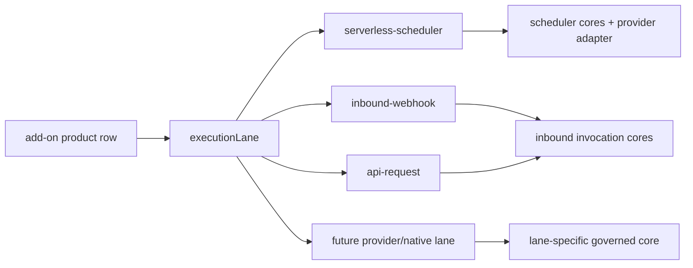

# Official Marketplace Plugins V1

Growthub Marketplace Plugins are governed workspace capabilities installed into
the existing Agent Workspace as Code universe. A plugin does not create a second
runtime, database, workflow engine, or mutation lane. It registers governed rows,
server-side env references, UI affordances, receipts, and provider-specific
adapters that operate through the workspace's existing control plane.

This is the official V1 plugin model for the custom workspace starter.

## Definition

An official marketplace plugin is a provider-backed capability bundle that can:

- register provider and product rows in the API Registry
- verify runtime readiness with server-side probes
- keep secrets in environment variables and persist only env references
- expose governed UI setup flows in the Add-ons Marketplace
- power workspace features through existing objects, routes, receipts, and
  helper surfaces
- record every install, run, callback, failure, and uninstall through
  `workspace:agent-outcomes`

Official plugins are workspace-native. They land as Data Model/API Registry
truth, not as opaque external app state.

## V1 Provider: Upstash

Upstash is the first official marketplace provider. The provider row represents
account/setup capability. Product rows represent runnable workspace
capabilities.

Provider:

- `providerId`: `upstash`
- provider account lane: Upstash Developer API
- setup fields: account email + management API key
- setup surface: Add-ons Marketplace / provider setup
- persisted truth: provider row and product rows in the API Registry
- secret rule: no API key, token, or signing key is persisted into config,
  receipts, browser payloads, or row output

## V1 Products

### Upstash QStash / Workflow

QStash is the first validated runnable plugin product.

It enables:

- serverless scheduled workflow runs
- deterministic per-workflow schedule ownership
- signed destination delivery
- signed callback/failure callback sync
- last-run proof written back to the owning workflow row
- `/schedule` cockpit visibility and controls
- receipt-backed audit for install, run, callback, and uninstall

Product identity:

- `productId`: `upstash-qstash`
- `integrationId`: `upstash-qstash-workflow`
- `authRef`: `QSTASH`
- execution lane: `serverless-scheduler`
- required env: `QSTASH_TOKEN`
- optional env: `QSTASH_URL`, `QSTASH_CURRENT_SIGNING_KEY`,
  `QSTASH_NEXT_SIGNING_KEY`

Validated V1 capability:

- QStash product sync verifies `/v2/schedules` over the live provider API.
- Serverless schedule install creates a real QStash schedule.
- QStash delivers to the workspace workflow destination.
- QStash callback returns success proof to the owning workflow row.
- Receipts record the full lifecycle.

### Upstash Redis

Redis is registered as a workspace data/cache capability.

It enables:

- Redis REST database registration
- governed env references for Redis URL/token
- readiness probing through `/ping`
- future cache, queue, rate-limit, and workspace data features

Product identity:

- `productId`: `upstash-redis`
- `integrationId`: `upstash-redis`
- `authRef`: `UPSTASH_REDIS`
- execution lane: `workspace-data`
- required env: `UPSTASH_REDIS_REST_URL`, `UPSTASH_REDIS_REST_TOKEN`

### Upstash Search

Search is registered as a retrieval/search capability.

It enables:

- search index registration
- governed env references for Search URL/token
- readiness probing through `/stats` and `/info`
- future workspace retrieval and document-search flows

Product identity:

- `productId`: `upstash-search`
- `integrationId`: `upstash-search`
- `authRef`: `UPSTASH_SEARCH`
- execution lane: `workspace-retrieval`
- required env: `UPSTASH_SEARCH_REST_URL`, `UPSTASH_SEARCH_REST_TOKEN`

### Upstash Vector

Vector is registered as a semantic retrieval capability.

It enables:

- vector index registration
- governed env references for Vector URL/token
- readiness probing through `/info`
- future semantic memory, retrieval, and embedding-backed workspace features

Product identity:

- `productId`: `upstash-vector`
- `integrationId`: `upstash-vector`
- `authRef`: `UPSTASH_VECTOR`
- execution lane: `workspace-retrieval`
- required env: `UPSTASH_VECTOR_REST_URL`, `UPSTASH_VECTOR_REST_TOKEN`

## V1 Provider: Vercel

Vercel is the second official marketplace provider and the first on the
bearer-token account lane. The provider row represents the account binding;
the product row represents the runnable one-click deployment capability.

Provider:

- `providerId`: `vercel`
- provider account lane: Vercel REST API (`Authorization: Bearer`)
- setup fields: access token + optional team ID (team-scoped tokens)
- setup surface: Add-ons Marketplace / provider setup
- account verification: live probe of `/v2/user` / `/v2/teams`
- persisted truth: provider row and product row in the API Registry
- secret rule: the token is stored only as the `VERCEL_TOKEN` env reference —
  never in config, receipts, browser payloads, or row output

### Vercel Deployments (One-Click Deploy)

Deployments is the validated runnable Vercel product.

It enables:

- server-side project discovery (`GET /v9/projects`; the browser never calls
  the Vercel API)
- linking each Vercel project as an atomic governed Data Model record in the
  `vercel-projects` custom object — zero schema/contract change
- one-click deploys through the governed deploy route
  (`POST /api/workspace/add-ons/vercel/deploy`): git-source lane for linked
  repos, redeploy lane for previously deployed projects
- deploy proof (deployment id, url, readyState) written back to the owning
  project record
- workflow linkage from the same record via the existing reference primitive
  (`linkedWorkflowRef` → sandbox-environment)
- receipt-backed audit for connect, link, and every deploy —
  `workspace-add-on-vercel-link` / `workspace-add-on-vercel-deploy`

Product identity:

- `productId`: `vercel-deployments`
- `integrationId`: `vercel-deployments`
- `authRef`: `VERCEL`
- execution lane: `workspace-deployments`
- required env: `VERCEL_TOKEN`
- optional env: `VERCEL_TEAM_ID`, `VERCEL_API_URL`

Validated V1 capability:

- Product sync verifies `/v9/projects` over the live provider API.
- Project link upserts governed `vercel-projects` records idempotently
  (operator extras and deploy proof are never clobbered by a re-link).
- One-click deploy auto-links the project first, so a deploy always lands as
  a governed Data Model record.
- Deploy surfaces: Add-ons Marketplace product cockpit and the project
  record's Data Model drawer (`Deploy to Vercel`).
- Receipts record the full lifecycle, including blocked outcomes with
  actionable next steps.

### Guided Create Production App (Vercel + GitHub)

Alongside "link existing", the Vercel provider page carries a guided creation
journey for new setups: private GitHub repo → starter seed → Vercel project
with the repo linked at creation (`POST /v11/projects` + `gitRepository`) →
initial deployment → governed record.

Journey contract:

- GitHub account lane: `GET/POST /api/workspace/add-ons/github/credentials`
  verifies a token against `GET /user` and persists only the `GITHUB_TOKEN`
  env reference (same pattern as the Vercel bearer lane)
- repo step: `POST …/vercel/create-app/github-repo` creates the PRIVATE repo
  (`/user/repos` or `/orgs/{org}/repos`) and seeds the starter page via the
  contents API — atomic step contract, real 2xx required
- project step: `POST …/vercel/create-app/project` creates the Vercel project
  with the repo linked at creation time (requires the Vercel GitHub App;
  failures map to specific guidance)
- validation gate: the creation steps write NOTHING to workspace config; the
  only persist in the chain is the existing governed deploy route, which runs
  after repo + project + deployment all return real successes and atomically
  writes the `vercel-projects` record with live proof
- success state: live production URL, repo link, deployment proof, and the
  governed Data Model record — every step's progress turns green only on a
  real server response (shared `deriveCreateAppChecklist` helper)
- receipts: `workspace-add-on-github-credentials` and
  `workspace-add-on-vercel-create-app` record published and blocked outcomes
  (token scope, name conflicts, GitHub App missing, deploy failures) with
  actionable next steps

## V1 Provider: Supabase

Supabase is the third official marketplace provider and the first on the
database-operations lane (`workspace-data`).

Provider:

- `providerId`: `supabase`
- provider account lane: Supabase Management API (Bearer personal access
  token), with a direct project-probe fallback (project URL + service key)
  when no management token is present
- setup fields: personal access token, or project URL + service role key
- setup surface: Add-ons Marketplace / provider setup
- persisted truth: provider row and product rows in the API Registry
- secret rule: identical to Upstash — no token or key is persisted into
  config, receipts, browser payloads, or row output; `.env.local` holds
  values, rows hold env-ref names only (including the `SUPABASE_API_KEY`
  alias write that lets the canonical `authRef` expansion resolve the key)

### Supabase Postgres (PostgREST)

Product identity:

- `productId`: `supabase-postgrest`
- `integrationId`: `supabase-postgrest`
- `authRef`: `SUPABASE`
- execution lane: `workspace-data`
- connector kind: `supabase-data`
- required env: `SUPABASE_URL`, `SUPABASE_SERVICE_ROLE_KEY`
- optional env: `SUPABASE_ANON_KEY`
- auth shape: key on the `apikey` header (gateway) plus `Authorization:
  Bearer` on the dedicated executors

Validated V1 capability:

- Resource discovery lists the account's projects over the Management API
  (`provider-bearer` mode) and binds the selected project's URL and keys to
  env refs (`urlTemplate` / `fromPath` mappings against
  `/v1/projects/{ref}/api-keys`).
- Product sync verifies the bound project with a read-only PostgREST probe.
- The `supabase-data` Workflow Canvas node executes governed database
  operations (select / insert / update / upsert / delete / rpc) through
  `POST /api/workspace/sandbox-run` with the same result envelope, node
  trace, and receipts as `api-registry-call`; filterless update/delete are
  refused before any request.
- External tables install as governed `data-source` Data Model objects, and
  the `/api/workspace/add-ons/[providerId]/data` route performs receipted
  pull / push (push verifies with a pull-merge round-trip) / bind / unbind —
  any governed object, the `workspace-app-registry` fleet table included,
  can bind to an external table.
- A tested `supabase-postgrest` row constructs a governed resolver through
  the Unified Resolver Registry (top-level PostgREST arrays profile clean),
  addressable at `/api/resolvers/supabase-postgrest`.
- `/settings/apps` derives a Supabase external link for the workspace app
  from the governed registry rows (same icon + popover + dedupe mechanism as
  the GitHub repository and Vercel deployment links), provider-agnostic over
  the `workspace-data` lane.
- Receipts (`workspace-add-on-data-sync` and the standard provider/product
  kinds) record the full lifecycle.
- **Live hydration (governed, power-when-present):** while a user views an
  externally-bound `data-source` object in the Data Model table, the
  `ExternalSyncHydrator` keeps it fresh. When the product declares a
  publishable key (`SUPABASE_ANON_KEY`) the governed GET serves it (service
  secret withheld) and the client opens a **Supabase Realtime**
  `postgres_changes` WebSocket; every external change triggers the SAME
  receipted `pull` action on the governed door. When Realtime is absent or
  the socket fails, it falls back to a **watch poll** against the GET's
  read-only drift lane (`?watch=<objectId>`), which compares the live
  external fingerprint with the object's stamped `lastSyncFingerprint` and
  pulls only on measured drift — no client-side merge, no client-held
  service credentials, no receipt spam.
- **Causation-state derivation:** `deriveExternalSyncfreshness` (in
  `workspace-external-sync.js`) reads the governed stamps
  (binding → sync stamp → receipt → fingerprint) into an evidence-ordered
  state — `unbound / never-synced / drifted / conflict / stale / synced` —
  with a `causeChain`. Every derived surface consumes it: the `/data` GET
  per object, the Data Model table hydrator pill, and the Workspace Lens
  "External tables" observability stat. Binding a table externally moves NO
  unrelated derived UI state (backwards-compatibility is unit-proven), and
  externally-held records co-exist seamlessly with local rows.

### Supabase Storage (Global CDN)

The **second product** on the Supabase provider — the exact Upstash
multi-product pattern (same account, distinct product row, distinct
execution lane). No new provider account; it rides the connected Supabase
credentials.

Product identity:

- `productId` / `integrationId`: `supabase-storage`
- `authRef`: `SUPABASE`
- execution lane: `workspace-storage` (isolated from the database lane)
- connector kind: `supabase-storage`
- required env: `SUPABASE_URL`, `SUPABASE_SERVICE_ROLE_KEY` (same account)
- `requiresProduct`: `supabase-postgrest` (a governed data table must exist
  to link to)

Gating (causation state, `deriveBucketProductState`): `provider-required →
link-required → ready → active`. Bucket creation is refused (receipted
`blocked`) until the provider is connected AND a governed data table is
linked.

Validated V1 capability (browser closed-loop proven, 17/17):

- The storage product installs through the same marketplace product-sync
  route + governed api-registry row as every other product.
- `link-table` binds the governed buckets object (a `data-source` object on
  the **dynamic integration binding** — `mode: "integration"`,
  `integrationId: supabase-storage`, resolved through its api-registry row,
  never a manual binding) to an existing governed data table.
- No-code one-click **create-bucket** (BucketManager UI) calls the real
  Supabase Storage API through the governed door
  (`/api/workspace/add-ons/[providerId]/storage`), reads the bucket back,
  and lands a governed record correlated 1:1 to the linked table — with the
  user's mental model surfaced directly: bucket name (live-normalized to the
  Supabase id), public/private access, MIME allowlist, file-size limit, and
  the public CDN URL for public buckets.
- `sync-buckets` reconciles the live inventory; `delete-bucket` removes the
  bucket externally and from the governed object. Every action is receipted
  (`workspace-add-on-storage`); the service key never enters a row, receipt,
  or response.
- `/settings/apps` derives a second Supabase icon (storage badge, deep-links
  the buckets console) alongside the database icon, deduped by provider+URL.

Deferred (explicit): scheduler-driven continuous sync (QStash → `pull`),
signed-URL issuance and object upload UI, relationship import, and conflict
auto-resolution policies.

## User Surfaces

Official marketplace plugins appear in these workspace surfaces:

- Add-ons Marketplace: provider/product setup, product verification, resource
  selection, env reference binding, Vercel project link + one-click deploy
  cockpit
- API Registry: persisted provider/product capability rows
- Data Model: governed `vercel-projects` records with per-record deploy,
  latest-deployment proof, and workflow linkage
- Workflow Canvas: trigger/runtime configuration and schedule ownership
- Workspace Helper: `/schedule` command entry point
- Schedule Cockpit: fleet view for scheduled, ready, blocked, and drifted
  workflows
- Settings / Apps: governed external links (GitHub repository, Vercel
  deployment, Supabase database) derived from registry rows, deduped by
  provider URL, with hover popovers
- Agent Outcomes: receipt ledger for every governed action

## Product Lane Dispatch

The add-on route surface is shared, but product behavior is lane-specific. This
keeps the route scalable for future provider and native products without making
every product a scheduler.

Current rules:

- `serverless-scheduler` products, including QStash, use the existing scheduler
  cores and provider adapters.
- `inbound-webhook` and `api-request` products are native workflow input
  methods. They use the inbound invocation cores and the workspace destination
  door, not QStash scheduler controls.
- `/schedule` remains a scheduler cockpit entry. Webhook and API Request belong
  to the workflow sidecar's input-method flow.
- Future add-ons should declare their lane and dispatch to a lane-specific
  governed core instead of widening QStash-specific behavior.

## Governance Rules

Marketplace plugins must obey the workspace mutation boundary:

- config changes go through `PATCH /api/workspace`
- serverless/sandbox execution goes through governed execution routes
- schedule operations go through the existing add-on schedule route and remain
  scheduler-lane behavior
- deployment operations go through the governed add-on deploy route
- receipts are written to `workspace:agent-outcomes`
- secrets remain server-side
- UI controls hand off to governed routes, not direct client-side config edits

## Adding the next provider

The full agent playbook — source-truth recon, provider grammar, governed
rows, icon standard, tests, and the mandatory real-browser closed-loop QA
bar — lives in
[`MARKETPLACE_PROVIDER_PLAYBOOK_V1.md`](./MARKETPLACE_PROVIDER_PLAYBOOK_V1.md)
with a matching agent skill (`growthub-marketplace-provider`) in
`.claude/skills/`.

## Coming Soon

The V1 marketplace shape is provider-agnostic. The next expansion points are:

- custom scheduler providers using the same `schedulerRegistryId` contract
- additional official provider packs
- marketplace-backed API Registry resource discovery
- hosted provider account authority when a workspace needs it
- richer Add-ons Marketplace install receipts and rollback surfaces
- plugin-specific cockpit lenses for data, retrieval, queue, and cache products

The invariant stays the same: plugins extend the governed workspace universe;
they do not bypass it.
