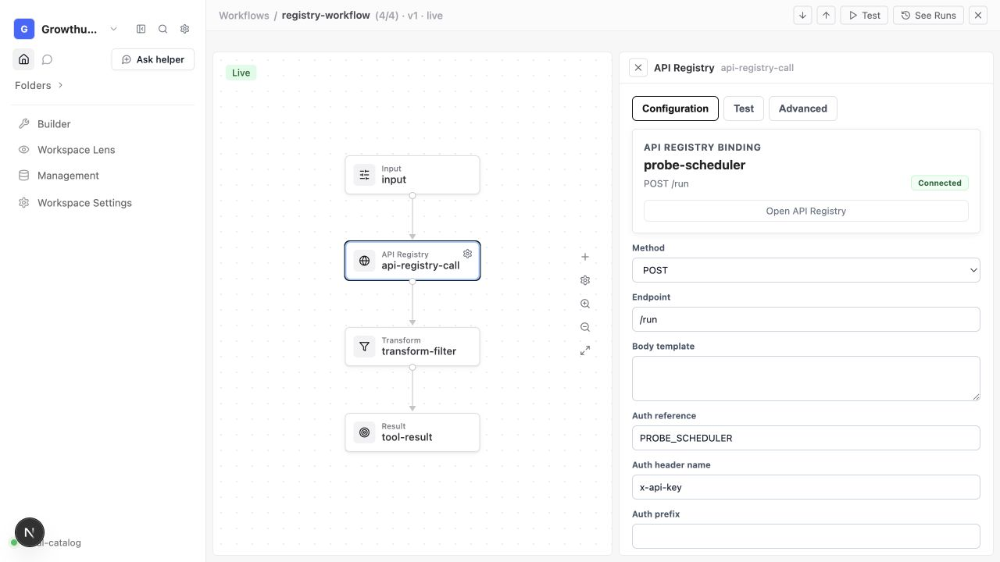
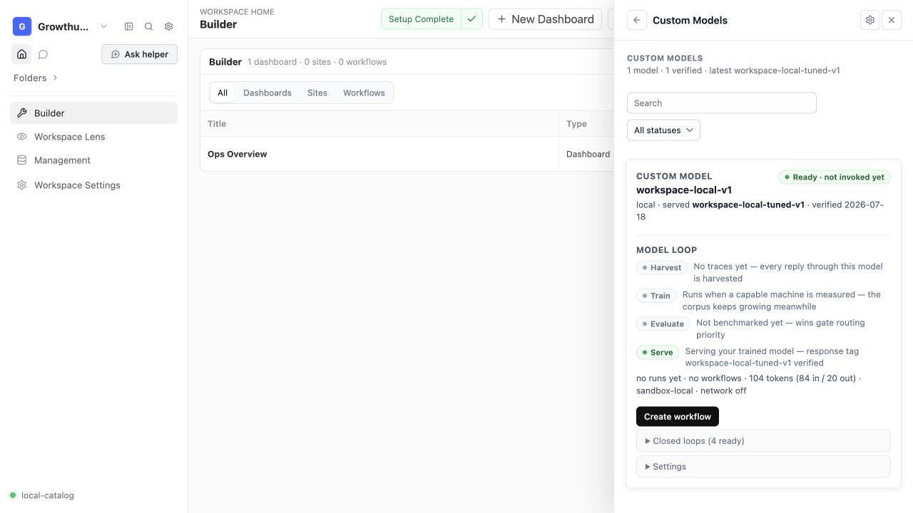

# API Registry node sidecar — 0.14.26 proof

Using Codex IAB via `browser-client.mjs`.

- Backend: `iab`.
- Current URL: `http://127.0.0.1:3777/workflows?object=sandbox-probe&row=registry-workflow&field=orchestrationConfig`.
- Visible surface: real Workflow Canvas, `registry-workflow`, API Registry node selected through the canvas.
- Live action layer: `tab.cua.click` on the rendered API Registry node.
- Readback layer: scoped `tab.playwright.evaluate` over `[data-node-registry-binding]`.

## Proven outcome

- Generic API Registry identity: `probe-scheduler`.
- Method and endpoint: `POST /run`.
- Connection badge: `Connected`.
- Capability-specific copy present: **false**.
- Action count: **1**.
- Action: `Open API Registry` → `/data-model`.
- Card width: **446 px**.
- Action row width: **416 px**.
- Button width: **416 px**.
- Full-width own-row agreement: **true**.

The Custom Models cockpit and its model-specific cards remain owned by
`CustomModelsLedger.jsx`; this change does not alter that component or its
workflow/model actions. The internal routing metadata remains intact while its
implementation label no longer leaks into API Registry display names.

## Custom Models continuity proof

- `CustomModelsLedger.jsx` and `custom-models-ledger.js` are absent from the
  `0.14.26` diff.
- The dedicated Custom Models regression suite passes **21/21**.
- The suite proves the command remains hidden without completed evidence and
  visible with it, the completed model card resolves its registry/sandbox/hash,
  workflow variants remain valid, and a generic chat-completions registry row
  alone never exposes Custom Models.
